|image0|

-  **WARNING**

This product has been developed by Aceinna exclusively for commercial
applications. It has not been tested for, and Aceinna makes no
representation or warranty as to conformance with, any military
specifications or that the product is appropriate for any military
application or end-use. Additionally, any use of this product for
nuclear, chemical, biological weapons, or weapons research, or for any
use in missiles, rockets, and/or UAV's of 300km or greater range, or any
other activity prohibited by the Export Administration Regulations, is
expressly prohibited without the written consent of Aceinna and without
obtaining appropriate US export license(s) when required by law.
Diversion contrary to law is prohibited.

©2018 Aceinna, Inc. All rights reserved. Information in this document is
subject to change without notice.

**Table of Contents **

`1 Introduction 1 <#introduction>`__

`1.1 Manual Overview 1 <#manual-overview>`__

`1.2 Overview of the MTLT Series Inertial Systems
2 <#overview-of-the-mtlt-series-inertial-systems>`__

`2 Connections 3 <#connections>`__

`2.1 Connections 3 <#connections-1>`__

`2.2 Power Input and Power Input Ground
3 <#power-input-and-power-input-ground>`__

`2.3 Serial Data Interface 3 <#serial-data-interface>`__

`2.4 Alarm 3 <#alarm>`__

`3 Installation and Operation of NAV-VIEW
4 <#installation-and-operation-of-nav-view>`__

`3.1 NAV-VIEW Computer Requirements
4 <#nav-view-computer-requirements>`__

`3.1.1 Install NAV-VIEW 4 <#install-nav-view>`__

`3.2 Connections 4 <#connections-2>`__

`3.3 Setting up NAV-VIEW 4 <#setting-up-nav-view>`__

`3.4 Data Recording 5 <#data-recording>`__

`3.5 Data Playback 6 <#data-playback>`__

`3.6 Raw Data Console 6 <#raw-data-console>`__

`3.7 Packet Statistics View 7 <#packet-statistics-view>`__

`3.8 Unit Configuration 8 <#unit-configuration>`__

`3.9 Advanced Configuration 9 <#advanced-configuration>`__

`3.10 Bit Configuration 11 <#bit-configuration>`__

`3.11 Tilt alarm 12 <#tilt-alarm>`__

`3.12 Read Unit Configuration 13 <#read-unit-configuration>`__

`4 Theory of Operation 14 <#theory-of-operation>`__

`4.1 MTLT Series Default Coordinate System
15 <#mtlt-series-default-coordinate-system>`__

`4.1.1 Advanced Settings 16 <#advanced-settings>`__

`4.2 Dynamic MTLT Theory of Operation
16 <#dynamic-mtlt-theory-of-operation>`__

`4.2.1 MTLT1xxD Advanced Settings 17 <#mtlt1xxd-advanced-settings>`__

`4.2.2 MTLT1xxD Built-In Test 18 <#mtlt1xxd-built-in-test>`__

`4.3 Tilt Alarm (Independent vs. Cone Angle) 19 <#_Toc469475110>`__

`5 Application Guide 20 <#application-guide>`__

`5.1 Introduction 20 <#introduction-1>`__

`5.2 Equipment Leveling and lockout
20 <#equipment-leveling-and-lockout>`__

`5.3 Aerial Work Platform Safety 21 <#aerial-work-platform-safety>`__

`5.4 Land Vehicle 21 <#land-vehicle>`__

`6 Programming Guide 22 <#programming-guide>`__

`6.1 General Settings 22 <#general-settings>`__

`6.2 Number Formats 22 <#number-formats>`__

`6.3 Packet Format 23 <#packet-format>`__

`6.3.1 Packet Header 23 <#packet-header>`__

`6.3.2 Packet Type 23 <#packet-type>`__

`6.3.3 Payload Length 23 <#payload-length>`__

`6.3.4 Payload 23 <#payload>`__

`6.3.5 16-bit CRC-CCITT 24 <#bit-crc-ccitt>`__

`6.3.6 Messaging Overview 24 <#messaging-overview>`__

`7 Communicating with the MTLT1 Series
26 <#communicating-with-the-mtlt1-series>`__

`7.1 Link Test. 26 <#link-test.>`__

`7.1.1 Ping Command 26 <#ping-command>`__

`7.1.2 Ping Response 26 <#ping-response>`__

`7.1.3 Echo Command 26 <#echo-command>`__

`7.1.4 Echo Response 26 <#echo-response>`__

`7.2 Interactive Commands 26 <#interactive-commands>`__

`7.2.1 Get Packet Request 26 <#get-packet-request>`__

`7.2.2 Algorithm Reset Command 27 <#algorithm-reset-command>`__

`7.2.3 Algorithm Reset Response 27 <#algorithm-reset-response>`__

`7.2.4 Error Response 27 <#error-response>`__

`7.3 Output Packets (Polled) 27 <#output-packets-polled>`__

`7.3.1 Identification Data Packet 27 <#identification-data-packet>`__

`7.3.2 Version Data Packet 28 <#version-data-packet>`__

`7.3.3 Test 0 (Detailed BIT and Status) Packet
28 <#test-0-detailed-bit-and-status-packet>`__

`7.4 Output Packets (Polled or Continuous)
29 <#output-packets-polled-or-continuous>`__

`7.4.1 Angle Data Packet 6 (Default Data)
29 <#angle-data-packet-6-default-data>`__

`7.4.2 Angle Data Packet 7 30 <#angle-data-packet-7>`__

`8 Advanced Commands 31 <#advanced-commands>`__

`8.1 Configuration Fields 31 <#configuration-fields>`__

`8.2 Continuous Packet Type Field 32 <#continuous-packet-type-field>`__

`8.3 Digital Filter Settings 32 <#digital-filter-settings>`__

`8.4 Orientation Field 32 <#orientation-field>`__

`8.5 User Behavior Switches 34 <#user-behavior-switches>`__

`8.6 Tilt alarm 34 <#tilt-alarm-1>`__

`8.7 Commands to Program Configuration
35 <#commands-to-program-configuration>`__

`8.7.1 Write Fields Command 35 <#write-fields-command>`__

`8.7.2 Set Fields Command 36 <#set-fields-command>`__

`8.8 Read Fields Command 37 <#read-fields-command>`__

`8.9 Read Fields Response 37 <#read-fields-response>`__

`8.10 Get Fields Command 37 <#get-fields-command>`__

`8.11 Get Fields Response 38 <#get-fields-response>`__

`9 Advanced BIT 39 <#advanced-bit>`__

`9.1 Built In Test (BIT) and Status Fields
39 <#built-in-test-bit-and-status-fields>`__

`9.2 Master BIT and Status (BITstatus) Field
41 <#master-bit-and-status-bitstatus-field>`__

`9.3 hardwareBIT Field 42 <#hardwarebit-field>`__

`9.4 hardwarePowerBIT Field 42 <#hardwarepowerbit-field>`__

`9.5 hardwareEnvironmentalBIT Field
42 <#hardwareenvironmentalbit-field>`__

`9.6 comBIT Field 42 <#combit-field>`__

`9.7 comSerialABIT Field 43 <#comserialabit-field>`__

`9.8 softwareBIT Field 43 <#softwarebit-field>`__

`9.9 softwareAlgorithmBIT Field 44 <#softwarealgorithmbit-field>`__

`9.10 softwareDataBIT Field 44 <#softwaredatabit-field>`__

`9.11 hardwareStatus Field 44 <#hardwarestatus-field>`__

`9.12 comStatus Field 44 <#comstatus-field>`__

`9.13 softwareStatus Field 45 <#softwarestatus-field>`__

`9.14 sensorStatus Field 45 <#sensorstatus-field>`__

`9.15 Configuring the Master Status
45 <#configuring-the-master-status>`__

`9.15.1 hardwareStatusEnable Field 45 <#hardwarestatusenable-field>`__

`9.15.2 comStatusEnable Field 46 <#comstatusenable-field>`__

`9.15.3 softwareStatusEnable Field 46 <#softwarestatusenable-field>`__

`9.15.4 sensorStatusEnable Field 46 <#sensorstatusenable-field>`__

`10 Appendix A. Mechanical Specifications
47 <#appendix-a.-mechanical-specifications>`__

`11 Appendix C. Sample Packet-Parser Code
48 <#appendix-c.-sample-packet-parser-code>`__

`11.1 Overview 48 <#overview>`__

`11.2 Code listing 49 <#code-listing>`__

`12 Appendix D. Sample Packet Decoding
55 <#appendix-d.-sample-packet-decoding>`__

`13 Warranty and Support Information
57 <#warranty-and-support-information>`__

`13.1 Customer Service 57 <#customer-service>`__

`13.2 Contact Directory 57 <#contact-directory>`__

`13.3 Return Procedure 57 <#return-procedure>`__

`13.3.1 Authorization 57 <#authorization>`__

`13.3.2 Identification and Protection
57 <#identification-and-protection>`__

`13.3.3 Sealing the Container 58 <#sealing-the-container>`__

`13.3.4 Marking 58 <#marking>`__

`13.3.5 Return Shipping Address 58 <#return-shipping-address>`__

`13.4 Warranty 58 <#warranty>`__

** About this Manual**

The following annotations have been used to provide additional
information.

**NOTE**

Note provides additional information about the topic.

**EXAMPLE**

Examples are given throughout the manual to help the reader understand
the terminology.

 **IMPORTANT**

This symbol defines items that have significant meaning to the user

|warning1| **WARNING**

The user should pay particular attention to this symbol. It means there
is a chance that physical harm could happen to either the person or the
equipment.

Introduction
============

Manual Overview
---------------

This manual provides a comprehensive introduction to Aceinna’s MTLT
Series industrial tilt sensor products. For users wishing to get started
quickly, please refer to the three page quick start guide included with
each shipment. Table 1 table highlights the content in each section and
suggests how to use this manual.

1. Manual Content

+-----------------------------------+-----------------------------------+
| **Manual Section**                | **Who Should Read ?**             |
+===================================+===================================+
|| **Section 1:**                   || All customers should read        |
|                                   || sections 1.1 and 1.2.            |
|| Manual Overview                  |                                   |
+-----------------------------------+-----------------------------------+
|| **Section 2: **                  || Customers who are connecting the |
|                                   || MTLT Series products into a      |
|| Connections                      || system with their own power      |
|                                   || supply and cable.                |
+-----------------------------------+-----------------------------------+
|| **Section 3: **                  || Customers who are installing the |
|                                   || MTLT Series products into a      |
|| Installation and Operation of    || system and need details on using |
|| NAV-VIEW                         || NAV-VIEW.                        |
+-----------------------------------+-----------------------------------+
|| **Section 4: **                  || All customers should read Section|
|                                   || 4.                               |
|| Theory of Operation              ||                                  |
|                                   || As the MTLT Series products are  |
|                                   || inter-related, use the chart at  |
|                                   || the beginning of Section 4 to    |
|                                   || ensure that you get an overview  |
|                                   || of all of the functions and      |
|                                   || features of your MTLT Series     |
|                                   || system.                          |
+-----------------------------------+-----------------------------------+
|| **Section 5: **                  || Customers who want product       |
|                                   || configuration tips for operating |
|| Application Guide                || the MTLT Series tilt sensors in a|
|                                   || wide range of applications.      |
+-----------------------------------+-----------------------------------+
|| **Section 6-9: **                || Customers who wish to communicate|
|                                   || with the MTLT Series system for  |
|| Programming, Communicating,      || sensor data, should review       |
|| Advanced Commands and BIT        || Section 6 and 7. Section 8 is for|
|                                   | users who wish to configure the   |
|                                   | MTLT Series operating parameters  |
|                                   | (e.g., baud rate or power-up      |
|                                   | output rate) without NAV-VIEW.    |
+-----------------------------------+-----------------------------------+

Overview of the MTLT Series Inertial Systems
--------------------------------------------

This manual provides a comprehensive introduction to the use of Aceinna’s
MTLT Industrial Tilt Sensor products listed in Table 2. This manual is
intended to be used as a detailed technical reference and operating
guide for the MTLT Series. Aceinna’s MTLT Series products combine the
latest in high-performance commercial MEMS (Micro-electromechanical
Systems) sensors and digital signal processing techniques to provide a
small, cost-effective alternative to existing tilt sensors.

2. MTLT Series Feature Description

+-----------------------+-----------------------+-----------------------+
| **Series**            | **Product**           | **Features**          |
+=======================+=======================+=======================+
| MTLT1 Series          | MTLT110S              || Accelerometer based  |
|                       |                       | static tilt sensor.   |
|                       |                       || 3-DOF Accelerometer  |
|                       |                       | data plus static Roll |
|                       |                       || and Pitch, plus a    |
|                       |                       | single pin tilt       |
|                       |                       || alarm. Plastic IP67  |
|                       |                       | Housing with a 1.0    |
|                       |                       || degree               |
|                       |                       | over-temperature      |
|                       |                       || accuracy on static   |
|                       |                       | tilt angles.          |
+-----------------------+-----------------------+-----------------------+
|                       | MTLT105S              || Accelerometer based  |
|                       |                       | static tilt sensor.   |
|                       |                       || 3-DOF Accelerometer  |
|                       |                       | data plus static Roll |
|                       |                       || and Pitch, plus a    |
|                       |                       | single pin tilt       |
|                       |                       || alarm. Plastic IP67  |
|                       |                       | Housing with a 0.5    |
|                       |                       || degree               |
|                       |                       | over-temperature      |
|                       |                       || accuracy on static   |
|                       |                       | tilt angles.          |
+-----------------------+-----------------------+-----------------------+
|                       | MTLT101S              || Accelerometer based  |
|                       |                       | static tilt sensor.   |
|                       |                       || 3-DOF Accelerometer  |
|                       |                       | data plus static Roll |
|                       |                       || and Pitch, plus a    |
|                       |                       | single pin tilt       |
|                       |                       || alarm. Plastic IP67  |
|                       |                       | Housing with a 0.1    |
|                       |                       || degree               |
|                       |                       | over-temperature      |
|                       |                       || accuracy on static   |
|                       |                       | tilt angles.          |
+-----------------------+-----------------------+-----------------------+
|                       | MTLT105D              || Gyro compensated     |
|                       |                       | dynamic tilt sensor.  |
|                       |                       || 3-DOF Accelerometer  |
|                       |                       | data, 3-DOF Gyro      |
|                       |                       || data, plus dynamic   |
|                       |                       | Roll and Pitch, plus  |
|                       |                       || a single pin tilt    |
|                       |                       | alarm. Plastic IP67   |
|                       |                       || Housing with a 0.5   |
|                       |                       | degree                |
|                       |                       || over-temperature     |
|                       |                       | accuracy on static    |
|                       |                       || tilt angles and 2.0  |
|                       |                       | degree accuracy on    |
|                       |                       || dynamic tilt angles. |
+-----------------------+-----------------------+-----------------------+
|                       | MTLT101D              || Gyro compensated     |
|                       |                       | dynamic tilt sensor.  |
|                       |                       || 3-DOF Accelerometer  |
|                       |                       | data, 3-DOF Gyro      |
|                       |                       || data, plus dynamic   |
|                       |                       | Roll and Pitch, plus  |
|                       |                       || a single pin tilt    |
|                       |                       | alarm. Plastic IP67   |
|                       |                       || Housing with a 0.1   |
|                       |                       | degree                |
|                       |                       || over-temperature     |
|                       |                       | accuracy on static    |
|                       |                       || tilt angles and 1.0  |
|                       |                       | degree accuracy on    |
|                       |                       || dynamic tilt angles. |
+-----------------------+-----------------------+-----------------------+

The MTLT Series continues in Aceinna’s long history of inertial sensors.
We have 20 years of history building inertial and tilt sensor products.
The MTLT Series comes in both a static (accelerometer only)
configuration for stationary or low speed applications, and a dynamic
(gyro compensated) configuration for mobile applications. Both static
and dynamic configurations use the same high-performance microprocessor
for on-board angle computations, and high-accuracy accelerometers.

The MTLT1 series sensors are housed in a sealed IP67 plastic enclosure
ideal for outdoor or external applications. The MTLT1 uses a standard
RS232 communication protocol for easy integration and a wide 9 – 32 volt
input power range.

In addition to the accelerometers, the dynamic MTLT also includes a
3-axis gyro for dynamic compensation. Traditional accelerometer only
tilt sensors are great in static or slow moving applications where the
linear accelerations are insignificant compared to the Earth’s gravity
vector. However, when placed in a moving vehicle (land, water, or
aerial), the linear accelerations of the vehicle motion can be
interpreted as changes in tilt. With a gyro compensated tilt sensor,
these linear accelerations can be filtered out by the on-board Kalman
filter resulting in an accurate tilt measurement across all dynamic.

Each sensor in the MTLT family includes a tilt alarm. The tilt alarm is
a single pin output that is raised high when the tilt exceeds a user
defined threshold. The user defined threshold can be set using the RS232
port. The tilt alarm is ideal for low-cost applications that may not
include a microprocessor for reading the tilt angles. After the
threshold is set, the alarm pin can be attached directly to a control
relay to lock out equipment when dangerous tilt levels are exceeded, or
simply attached to an LED to give an operator an indication that he/she
is driving on an unsafe incline.

The MTLT Series is supported by Aceinna’s NAV-VIEW, a powerful PC-based
operating tool that provides complete field configuration, diagnostics,
charting of sensor performance, and data logging with playback.

Connections 
============

.. _connections-1:

Connections
-----------

The MTLT1 Series has 6 flying leads on a 1 meter long cable

3. Connector Pin Assignments

+-----------+--------------+
| **Color** | **Signal**   |
+-----------+--------------+
| Red       | Power Input  |
+-----------+--------------+
| Black     | Power Return |
+-----------+--------------+
| Green     | RS232-RX     |
+-----------+--------------+
| Yellow    | Tilt Alarm   |
+-----------+--------------+
| Orange    | RS232-TX     |
+-----------+--------------+
| Brown     | RS232 Return |
+-----------+--------------+

The maintain IP67 performance, the user must carefully seal the
terminations of the flying leads.

Power Input and Power Input Ground
----------------------------------

Power is applied to the MTLT1 Series sensor on red and black leads. The
black wire is ground; the red wire should have 9 to 32 VDC.

-  **WARNING**

Do not reverse the power leads or damage may occur.

Serial Data Interface
---------------------

The serial interface is standard RS-232, 9600, 19200, 38400, or 57600
baud, 8 data bits, 1 start bit, 1 stop bit, no parity, and no flow
control and will output at a user configurable output rate. The green
and orange leads are designated as the main RS-232 interface pins. The
serial data settings can be configured on a MTLT1 Series unit with
NAV-VIEW. In order to set the serial data interface, select Unit
Configuration, under the Menu Tab.

Alarm
-----

The Alarm output is normally pulled low by a current sinking transistor.
When the Alarm threshold is exceeded the transistor is turned off and
the output will be pulled high by a 10K 1/16W resistor to the internal
3.3 Volt power supply.

Installation and Operation of NAV-VIEW
======================================

NAV-VIEW allows users to control all aspects of the MTLT Series
operation including data recording, definable alarm threshold and data
transfer. In addition you will be able to control the orientation of the
unit, sampling rate, packet type, and filter settings.

NAV-VIEW Computer Requirements 
-------------------------------

The following are minimum requirements for the installation of the
NAV-VIEW Software:

• CPU: Pentium-class (1.5GHz minimum)

• RAM Memory: 500MB minimum, 1GB+ recommended

• Hard Drive Free Memory: 20MB

• Operating System: Windows 2000™, or XP™, Windows® 7

• Properly installed Microsoft .NET 2.0 or higher

Install NAV-VIEW
~~~~~~~~~~~~~~~~

    To install NAV-VIEW onto your computer:

    1. Insert the CD “Inertial Systems Product Support” (Part No.
    8160-0063) in the CD-ROM drive.

    2. Locate the “NAV-VIEW” folder. Double click on the “setup.exe”
    file.

    3. Follow the setup wizard instructions. You will install NAV-VIEW
    and .NET 2.0 framework.

.. _connections-2:

Connections 
------------

The MTLT1 Series Inertial Systems products are shipped flying leads. To
connect to NAV-VIEW the flying leads can be attached to a standard DB9
connector.

1. Connect the green lead (RS232-RX) to pin 3 of the DB9 connector

2. Connect the orange lead (RS232-TX) to pin 2 of the DB9 connector

3. Connect the brown lead (RS232-GND) to pin 5 of the DB9 connector

4. Connect the red lead (+) to power supply positive, 9-32VDC

5. Connect the black lead (-) to power supply negative

6. Connect the yellow lead (Alarm) to oscilloscope or DMM. GND is brown
   lead

Note: Allow at least 60 seconds after power up for the MTLT1 Series
product to

initialize. The MTLT1 Series needs to be held motionless during this
period.

|warning1| **WARNING**

**Do not reverse the power leads!** Reversing the power leads to the
MTLT Series can damage the unit; although there is reverse power
protection, Aceinna is not responsible for resulting damage to the unit
should the reverse voltage protection electronics fail.

Setting up NAV-VIEW
-------------------

With the MTLT Series product powered up and connected to your PC serial
port, open the NAV-VIEW software application.

1. NAV-VIEW should automatically detect the MTLT Series product and
display the serial number and firmware version if it is connected.

2. If NAV-VIEW does not connect, check that you have the correct COM
port selected. You will find this under the “Setup” menu. Select the
appropriate COM port and allow the unit to automatically match the baud
rate by leaving the “Auto: match baud rate” selection marked.

3. If the status indicator at the bottom is green and states,
|UnitConnected|, you’re ready to go. If the status indicator doesn’t say
connected and is red, check the connections between the MTLT Series
product and the computer, check the power supply, and verify that the
COM port is not occupied by another device.

4. Under the “View” menu you have several choices of data presentation.
Graph display is the default setting and will provide a real time graph
of all the MTLT Series data. The remaining choices will be discussed in
the following pages.

Data Recording
--------------

NAV-VIEW allows the user to log data to a text file (.txt) using the
simple interface at the top of the screen. Customers can now tailor the
type of data, rate of logging and can even establish predetermined
recording lengths.

To begin logging data follow the steps below (See Figure 1):

1. Locate the |Folder|\ icon at the top of the page or select “Log to
   File” from the “File” drop down menu.

2. The following menu will appear.

1. Log to File Dialog Screen

|LogFile|

3. Select the “Browse” box to enter the file name and location that you
   wish to save your data to.

4. Select the type of data you wish to record. “Engineering Data”
   records the converted values provided from the system in engineering
   units, “Hex Data” provides the raw hex values separated into columns
   displaying the value, and the “Raw Packets” will simply record the
   raw hex strings as they are sent from the unit.

5. Users can also select a predetermined “Test Duration” from the menu.
   Using the arrows, simply select the duration of your data recording.

6. Logging Rate can also be adjusted using the features on the right
   side of the menu.

7. Once you have completed the customization of your data recording, you
   will be returned to the main screen where you can start the recording
   process using the |RecordButton| button at the top of the page or
   select “Start Logging” from the “File” menu. Stopping the data
   recording can be accomplished using the |stop-button| button and the
   recording can also be paused using the |Pause-button| button.

Data Playback
-------------

In addition to data recording, NAV-VIEW allows the user to replay saved
data that has been stored in a log file.

1. To playback data, select “Playback Mode” from the “Data Source” drop
   down menu at the top. |Data-Source|

2. Selecting Playback mode will open a text prompt which will allow
   users to specify the location of the file they wish to play back. All
   three file formats are supported (Engineering, Hex, and Raw) for
   playback. In addition, each time recording is stopped/started a new
   section is created. These sections can be individually played back by
   using the drop down menu and associated VCR controls.

3. Once the file is selected, users can utilize the VCR style controls
   at the top of the page to start, stop, and pause the playback of the
   data.

4. NAV-VIEW also provides users with the ability to alter the start time
   for data playback. Using the |Slidebar| slide bar at the top of the
   page users can adjust the starting time.

Raw Data Console
----------------

NAV-VIEW offers some unique debugging tools that may assist programmers
in the development process. One such tool is the Raw Data Console. From
the “View” drop down menu, simply select the “Raw Data Console”. This
console provides users with a simple display of the packets that have
been transmitted to the unit (Tx) and the messages received (Rx). An
example is provided in Figure 2.

2. Raw Data Console

|image10|

Packet Statistics View
----------------------

Packet statistics can be obtained from the “View” menu by selecting the
“Packet Statistics” option (See Figure 3). This view simply provides the
user with a short list of vital statistics (including Packet Rate, CRC
Failures, and overall Elapsed Time) that are calculated over a one
second window. This tool should be used to gather information regarding
the overall health of the user configuration. Incorrectly configured
communication settings can result in a large number of CRC Failures and
poor data transfer.

3. Packet Statistics

|PacketStatistics|

Unit Configuration
------------------

The Unit Configuration window (See Figure 4) gives the user the ability
to view and alter the system settings. This window is accessed through
the “Unit Configuration” menu item under the configuration menu. Under
the “General” tab, users have the ability to verify the current
configuration by selecting the “Get All Values” button. This button
simply provides users with the currently set configuration of the unit
and displays the values in the left column of boxes.

There are four tabs within the “Unit Configuration” menu; General,
Advanced, BIT Configuration and tilt alarm. The General tab displays
some of the most commonly used settings. The Advanced , BIT
Configuration and tilt alarm menus provide users with more detailed
setting information that they can tailor to meet their specific needs.

To alter a setting, simply select the check box on the left of the value
that you wish to modify and then select the value using the drop down
menu on the right side. Once you have selected the appropriate value,
these settings can be set temporarily or permanently (a software reset
or power cycle is required for the changes to take affect) by selecting
from the choices at the bottom of the dialog box. Once the settings have
been altered a “Success” box will appear at the bottom of the page.

**IMPORTANT**

Caution must be taken to ensure that the settings selected are
compatible with the system that is being configured. In most cases a
“FAIL” message will appear if incompatible selections are made by the
user, however it is the users responsibility to ensure proper
configuration of the unit.

**IMPORTANT**

Unit orientation selections must conform to the right hand coordinate
system as noted in Section 4.1 of this user manual. Selecting
orientations that do not conform to this criteria are not allowed.

4. Unit Configuration

|image12|

Advanced Configuration
----------------------

Users who wish to access some of the more advanced features of NAV-VIEW
and the MTLT1 Series products can do so by selecting the “Advanced” tab
at the top of the “Unit Configuration” window.

|warning1| **WARNING**

Users are strongly encouraged to read and thoroughly understand the
consequences of altering the settings in the “Advanced” tab before
making changes to the unit configuration. These settings are discussed
in detail in Chapter 4 below.

Behavior switches are identified at the top of the page with marked
boxes. A blue box will appear if a switch has been enabled similar to
Figure 5 below. The values can be set in the same manner as noted in the
previous section. To set a value, users select the appropriate “Modify”
checkbox on the left side of the menu and select or enable the
appropriate value they wish to set. At the bottom of the page, users
have the option of temporarily or permanently setting values. When all
selections have been finalized, simply press the “Set Values” button to
change the selected settings.

5. Advanced Settings

|image13|

Bit Configuration
-----------------

The third tab of the unit configuration window is “Bit Configuration”
(See Figure 6). This tab allows the users to alter the logic of
individual status flags that affect the masterStatus flag in the master
BITstatus field (available in most output packets). By enabling
individual status flags users can determine which flags are logically
OR’ed to generate the masterStatus flag. This gives the user the
flexibility to listen to certain indications that affect their specific
application. The masterFail and all error flags are not configurable.
These flags represent serious errors and should never be ignored.

6. BIT Configuration

|image14|

Tilt alarm
----------

The final tab of the unit configuration window is “Tilt alarm” (See
Figure 7). This tab allows the users to select alarm source and set
alarm threshold angles with hysteresis.

Tilt alarm selector: independent roll/pitch or cone angle

Alarm limit: alarm upper and lower limits.

Hysteresis: alarm limit hysteresis

**Figure 7. Tilt alarm**

|image15|

 Read Unit Configuration
------------------------

NAV-VIEW allows users to view the current settings and calibration data
for a given MTLT Series unit by accessing the “Read Configuration”
selection from the “Configuration” drop down menu (See Figure 8). From
this dialog, users can print a copy of the unit’s current configuration
and calibration values with the click of a button. Simply select the
“Read” button at the top of the dialog box and upon completion select
the “Print” or “Print Preview” buttons to print a copy to your local
network printer. This information can be helpful when storing hard
copies of unit configuration, replicating the original data sheet and
for troubleshooting if you need to contact Aceinna’s Support Staff.

Figure 8. Read Configuration

|image16|

Theory of Operation 
====================

This section of the manual covers detailed theory of operation for both
the static and dynamic versions of the MTLT series family.

4. MTLT1 Series Overview

+-------------+----------------------------------------+-----------------------+
| **Product** | **Features**                           | **Learning More**     |
+=============+========================================+=======================+
| MTLT1xxS    | Accelerometer-based static tilt sensor | Read 4.1 and 4.2      |
+-------------+----------------------------------------+-----------------------+
| MTLT1xxD    | Gyro-compensated dynamic tilt sensor   | Read 4.1, 4.2 and 4.3 |
+-------------+----------------------------------------+-----------------------+

Figure 9 shows the MTLT Series hardware block diagram. At the core of
the MTLT Series is a high-performance MEMS 3-axis accelerometer. The
dynamic MTLT tilt sensors also include a 3-axis MEMS gyroscope used for
linear acceleration compensation. These sensors are based on rugged,
field proven silicon bulk micromachining technology. Each sensor within
the cluster is individually factory calibrated using Aceinna’s automated
manufacturing process. Sensor errors are compensated for temperature
bias, scale factor, non-linearity and misalignment effects using a
proprietary algorithm from data collected during manufacturing.
Accelerometer, rate gyro, and magnetometer sensor bias shifts over
temperature (-40 :sup:`0`\ C to +70 :sup:`0`\ C) are compensated and
verified using calibrated thermal chambers and rate tables. The sensor
data is fed into a high-speed microprocessor which calculates the roll
and pitch data using our proprietary Kalman filters.

Figure 9. MTLT Series Hardware Block Diagram

Figure 10 shows the software block diagram. The accelerometer and gyro
(dynamic only) sensor data is fed into a high speed 200Hz signal
processing chain. Measurement data packets are available at fixed
continuous output rates or on a polled basis.

Figure 10. MTLT Series Software Block Diagram

Figure 9 shows a simplified functional block diagrams for MTLT static
and dynamic sensors. Dynamic sensors include a 3-axis gyro and take
advantage of the Extended Kalman Filter. The common aiding sensor for
the drift correction for the attitude (i.e., roll and pitch only) is a
3-axis accelerometer.

MTLT Series Default Coordinate System
-------------------------------------

The MTLT Series Inertial System default coordinate system is shown in
Figure 11. As with many elements of the MTLT Series, the coordinate
system is configurable with either NAV-VIEW or by sending the
appropriate serial commands. These configurable elements are known as
***Advanced Settings***. This section of the manual describes the
default coordinate system settings of the MTLT Series when it leaves the
factory.

With the MTLT Series product connector facing you, and the label facing
up, the axes are defined as follows:

Figure 11. MTLT1 Series Default Coordinate System

|image17|

    **x-axis** – from face with connector through the MTLT unit

    **y-axis** – along the face with connector from left to right

    **z-axis** – along the face with the connector from top to bottom

The axes form an orthogonal SAE right-handed coordinate system.
Acceleration is positive when it is oriented towards the positive side
of the coordinate axis. For example, with a MTLT Series product sitting
on a level table, it will measure zero g along the x- and y-axes and -1
g along the z-axis. Normal Force acceleration is directed upward, and
thus will be defined as negative for the MTLT Series z-axis.

The angular rate sensors are aligned with these same axes. The rate
sensors measure angular rotation rate around a given axis. The rate
measurements are labeled by the appropriate axis. The direction of a
positive rotation is defined by the right-hand rule. With the thumb of
your right hand pointing along the axis in a positive direction, your
fingers curl around in the positive rotation direction. For example, if
the MTLT Series product is sitting on a level surface and you rotate it
clockwise on that surface, this will be a positive rotation around the
z-axis. The x- and y-axis rate sensors would measure zero angular rates,
and the z-axis sensor would measure a positive angular rate.

Pitch is defined positive for a positive rotation around the y-axis
(pitch up). Roll is defined as positive for a positive rotation around
the x-axis (roll right). Yaw is defined as positive for a positive
rotation around the z-axis (turn right).

The angles are defined as standard Euler angles using a 3-2-1 system. To
rotate from the body frame to an earth-level frame, roll first, then
pitch, and then yaw.

Advanced Settings
~~~~~~~~~~~~~~~~~

The MTLT Series Inertial Systems have a number of advanced settings that
can be changed. All units support baud rate, power-up output packet
type, output rate, sensor low pass filtering, tilt-alarm configurations,
and custom axes configuration. The units can be configured using
NAV-VIEW, as described in Section 3, and also directly with serial
commands as described in Sections 6-9.

**IMPORTANT**

The Delta-Theta, Delta-V packet is only recommended for use in
continuous output mode at 5Hz or greater. Polled requests for this
packet will produce values accumulated since the last poll request, and
thus, are subject to overflow (data type wrap around).

4.2 Dynamic MTLT Theory of Operation
------------------------------------

The MTLT1xxD supports dynamic roll and pitch measurements that are
stabilized by the using the accelerometers as a long-term gravity
reference and gyro for dynamic motion compensation. At a fixed 200Hz
rate, the MTLT1xxD continuously maintains both the calibrated sensor
(accelerometer and gyro) data as well as the roll and pitch data. As
shown in the software block diagram Figure 10, after the Sensor
Calibration block, the sensor data is passed into an Integration to
Orientation block. The Integration to Orientation block integrates body
frame sensed angular rate to orientation at a fixed 200 times per second
within all of the MTLT1xxD Series products. For improved accuracy and to
avoid singularities when dealing with the cosine rotation matrix, a
quaternion formulation is used in the algorithm to provide attitude
propagation.

As also shown in the software block diagram, the Integration to
Orientation block receives drift corrections from the Extended Kalman
Filter or Drift Correction Module. In general, rate sensors and
accelerometers suffer from bias drift, misalignment errors, acceleration
errors (g-sensitivity), nonlinearity (square terms), and scale factor
errors. The largest error in the orientation propagation is associated
with the rate sensor bias terms. The Extended Kalman Filter (EKF) module
provides an on-the-fly calibration for drift errors, including the rate
sensor bias, by providing corrections to the Integration to Orientation
block and a characterization of the gyro bias state. In the MTLT1xxD,
the internally computed gravity reference vector provides a reference
measurement for the EKF when the MTLT1xxD is in quasi-static motion to
correct roll and pitch angle drift and to estimate the X and Y gyro rate
bias. Because the gravity vector has no horizontal component, the EKF
has no ability to estimate either the yaw angle error or the Z gyro rate
bias. The MTLT1xxD adaptively tunes the EKF feedback in order to best
balance the bias estimation and attitude correction with distortion free
performance during dynamics when the object is accelerating either
linearly (speed changes) or centripetally (false gravity forces from
turns). Because centripetal and other dynamic accelerations are often
associated with yaw rate, the MTLT1xxD maintains a low-passed filtered
yaw rate signal and compares it to the turnSwitch threshold field (user
adjustable). When the user platform to which the MTLT1xxD is attached
exceeds the turnSwitch threshold yaw rate, the MTLT1xxD lowers the
feedback gains from the accelerometers to allow the attitude estimate to
coast through the dynamic situation with primary reliance on angular
rate sensors. This situation is indicated by the
softwareStatusturnSwitch status flag. Using the turn switch maintains
better attitude accuracy during short-term dynamic situations, but care
must be taken to ensure that the duty cycle of the turn switch generally
stays below 10% during the vehicle mission. A high turn switch duty
cycle does not allow the system to apply enough rate sensor bias
correction and could allow the attitude estimate to become unstable.

The MTLT1xxD algorithm has two major phases of operation. The first
phase of operation is the initialization phase. During the
initialization phase, the MTLT1xxD is expected to be stationary or
quasi-static so the EKF weights the accelerometer gravity reference
heavily in order to rapidly estimate the roll and pitch angles, and X, Y
rate sensor bias. The initialization phase lasts approximately 60
seconds, and the initialization phase can be monitored in the
softwareStatus BIT transmitted by default in each measurement packet.
After the initialization phase, the MTLT1xxD operates with lower levels
of feedback (also referred to as EKF gain) from the accelerometers to
continuously estimate and correct for roll and pitch errors, as well as
to estimate X and Y rate sensor bias.

If a user wants to reset the algorithm or re-enter the initialization
phase, sending the algorithm reset command, ‘AR’, will force the
algorithm into the reset phase.

The MTLT1xxD outputs digital measurement data over the RS-232 serial
link at a selectable fixed rate (100, 50, 25, 20, 10, 5 or 2 Hz) or on
as requested basis using the GP, ‘Get Packet’ command.

4.2.1 MTLT1xxD Advanced Settings
~~~~~~~~~~~~~~~~~~~~~~~~~~~~~~~~

In addition to the configurable baud rate, packet rate, axis
orientation, and sensor low-pass filter settings, the MTLT1xxD provides
additional advanced settings which are selectable for tailoring the
MTLT1xxD to a specific application requirements. These MTLT1xxD advanced
settings are shown in Table 10 below:

5. MTLT1xxD Series Advanced Settings

+-----------------------+-----------------------+-----------------------+
| **Setting**           | **Default**           | **Comments**          |
+=======================+=======================+=======================+
| **Baud Rate**         | 38400                 || 57600, 115200,23040  |
|                       |                       || also available       |
+-----------------------+-----------------------+-----------------------+
| **Packet Type**       | A6                    | A7 also available     |
+-----------------------+-----------------------+-----------------------+
| **Packet Rate**       | 25Hz                  || This setting sets the|
|                       |                       | rate at which         |
|                       |                       || selected Packet Type,|
|                       |                       | packets are output.   |
|                       |                       || If polled mode is    |
|                       |                       | desired, then select  |
|                       |                       || Quiet. If Quiet is   |
|                       |                       | selected, the         |
|                       |                       || MTLT1xxD will only   |
|                       |                       | send measurement      |
|                       |                       || packets in response  |
|                       |                       | to GP commands.       |
+-----------------------+-----------------------+-----------------------+
| **Orientation**       | See                   || To configure the axis|
|                       |                       | orientation, select   |
|                       | Fig. 12               || the desired          |
|                       |                       | measurement for each  |
|                       |                       || axes: NAV-VIEW will  |
|                       |                       | show the              |
|                       |                       || corresponding image  |
|                       |                       | of the MTLT1xxD, so   |
|                       |                       || it easy to visualize |
|                       |                       | the mode of           |
|                       |                       || operation. See       |
|                       |                       | Section 8.4           |
|                       |                       || Orientation Field    |
|                       |                       | settings for the      |
|                       |                       || twenty four possible |
|                       |                       | orientation settings. |
|                       |                       || The default setting  |
|                       |                       | points the connector  |
|                       |                       || AFT.                 |
+-----------------------+-----------------------+-----------------------+
| **Filter Settings (5, | 20 Hz                 || The low pass filters |
| 10, 20, 50 Hz)**      |                       | are set to a default  |
|                       |                       || of 5Hz for the       |
|                       |                       | accelerometers, and   |
|                       |                       || 20 Hz for the angular|
|                       |                       | rate sensors.         |
+-----------------------+-----------------------+-----------------------+
| **Freely Integrate**  | OFF                   || The Freely Integrate |
|                       |                       | setting allows a user |
|                       |                       || to turn the MTLT1xxD |
|                       |                       | into a ‘free gyro’.   |
|                       |                       || In free gyro mode,   |
|                       |                       | the roll, pitch and   |
|                       |                       || yaw are computed     |
|                       |                       | exclusively from      |
|                       |                       || angular rate with no |
|                       |                       | kalman filter based   |
|                       |                       || corrections of roll, |
|                       |                       | pitch, or yaw. When   |
|                       |                       || turned on, there is  |
|                       |                       | no coupling of        |
|                       |                       || acceleration based   |
|                       |                       | signals into the roll |
|                       |                       || and pitch. As a      |
|                       |                       | result, the roll,     |
|                       |                       || pitch, and yaw       |
|                       |                       | outputs will drift    |
|                       |                       || roughly linearly with|
|                       |                       | time due to sensor    |
|                       |                       || bias. For best       |
|                       |                       | performance, the      |
|                       |                       || Freely Integrate mode|
|                       |                       | should be used after  |
|                       |                       || the algorithm has    |
|                       |                       | initialized. This     |
|                       |                       || allows the Kalman    |
|                       |                       | Filter to estimate    |
|                       |                       || the roll and pitch   |
|                       |                       | rate sensor bias      |
|                       |                       || prior to entering the|
|                       |                       | free gyro mode. Upon  |
|                       |                       || exiting the ‘free    |
|                       |                       | gyro’ mode (OFF), one |
|                       |                       || of two behaviors will|
|                       |                       | occur                 |
|                       |                       |                       |
|                       |                       || (1) If the MTLT1xxD  |
|                       |                       |     has been in       |
|                       |                       ||     freely integrate |
|                       |                       |     mode for less     |
|                       |                       |     than sixty        |
|                       |                       ||     seconds, the     |
|                       |                       |     algorithm will    |
|                       |                       |     resume operation  |
|                       |                       ||     at normal gain   |
|                       |                       |     settings          |
|                       |                       |                       |
|                       |                       || (2) If the MTLT1xxD  |
|                       |                       |     has been in       |
|                       |                       |     freely integrate  |
|                       |                       ||     mode for greater |
|                       |                       |     than sixty        |
|                       |                       |     seconds, the      |
|                       |                       ||     algorithm will   |
|                       |                       |     force a reset and |
|                       |                       |     reinitialize with |
|                       |                       ||     high gains       |
|                       |                       |     automatically.    |
+-----------------------+-----------------------+-----------------------+
| **Restart On Over     | OFF                   || This setting forces  |
| Range**               |                       | an algorithm reset    |
|                       |                       || when a sensor over   |
|                       |                       | range occurs i.e., a  |
|                       |                       || rotational rate on   |
|                       |                       | any of the three axes |
|                       |                       || exceeds the maximum  |
|                       |                       | range. The default    |
|                       |                       || setting is OFF for   |
|                       |                       | the MTLT1xxD.         |
|                       |                       || Algorithm reset      |
|                       |                       | returns the MTLT1xxD  |
|                       |                       || to a high gain state,|
|                       |                       | where the MTLT1xxD    |
|                       |                       || rapidly estimates the|
|                       |                       | gyro bias and uses    |
|                       |                       || the accelerometer    |
|                       |                       | feedback heavily.     |
|                       |                       || This setting is      |
|                       |                       | recommended when the  |
|                       |                       || source of over-range |
|                       |                       | is likely to be       |
|                       |                       || sustained and        |
|                       |                       | potentially much      |
|                       |                       || greater than the rate|
|                       |                       | sensor operating      |
|                       |                       || limit. Large and     |
|                       |                       | sustained angular     |
|                       |                       || rate over-ranges     |
|                       |                       | result in             |
|                       |                       || unrecoverable errors |
|                       |                       | in roll and pitch     |
|                       |                       || outputs. An          |
|                       |                       | unrecoverable error   |
|                       |                       || is one where the EKF |
|                       |                       | can not stabilize the |
|                       |                       || resulting roll and   |
|                       |                       | pitch reading. If the |
|                       |                       || over-ranges are      |
|                       |                       | expected to be of     |
|                       |                       || short duration (<1   |
|                       |                       | sec) and a modest     |
|                       |                       || percentage over the  |
|                       |                       | maximum operating     |
|                       |                       || range, it is         |
|                       |                       | recommended that the  |
|                       |                       || restart on over range|
|                       |                       | setting be turned     |
|                       |                       || off. Handling of an  |
|                       |                       | inertial rate sensor  |
|                       |                       || over-range is        |
|                       |                       | controlled using the  |
|                       |                       || restartOnOverRange   |
|                       |                       | switch. If this       |
|                       |                       || switch is off, the   |
|                       |                       | system will flag the  |
|                       |                       || overRange status flag|
|                       |                       | and continue to       |
|                       |                       || operate through it.  |
|                       |                       | If this switch is on, |
|                       |                       || the system will flag |
|                       |                       | a masterFail error    |
|                       |                       || during an over-range |
|                       |                       | condition and         |
|                       |                       || continue to operate  |
|                       |                       | with this flag until  |
|                       |                       || a quasi-static       |
|                       |                       | condition is met to   |
|                       |                       || allow for an         |
|                       |                       | algorithm restart.    |
|                       |                       || The quasi-static     |
|                       |                       | condition required is |
|                       |                       || that the absolute    |
|                       |                       | value of each         |
|                       |                       || low-passed rate      |
|                       |                       | sensor fall below 3   |
|                       |                       || deg/sec to begin     |
|                       |                       | initialization. The   |
|                       |                       || system will then     |
|                       |                       | attempt a normal      |
|                       |                       || algorithm start.     |
+-----------------------+-----------------------+-----------------------+
| **Dynamic Motion**    | ON                    || The default setting  |
|                       |                       | is ON for the         |
|                       |                       || MTLT1xxD. Turning off|
|                       |                       | the dynamic motion    |
|                       |                       || setting results in a |
|                       |                       | higher gain state     |
|                       |                       || that uses the        |
|                       |                       | accelerometer         |
|                       |                       || feedback heavily.    |
|                       |                       | During periods of     |
|                       |                       || time when there is   |
|                       |                       | known low dynamic     |
|                       |                       || acceleration, this   |
|                       |                       | switch can be turned  |
|                       |                       || off to allow the     |
|                       |                       | attitude estimate to  |
|                       |                       || quickly stabilize.   |
+-----------------------+-----------------------+-----------------------+
| **Turn Switch         | 10.0 deg/sec          || With respect to      |
| threshold**           |                       | centripetal or false  |
|                       |                       || gravity forces from  |
|                       |                       | turning dynamics (or  |
|                       |                       || coordinated turn),   |
|                       |                       | the MTLT1xxD monitors |
|                       |                       || the yaw-rate. If the |
|                       |                       | yaw rate exceeds a    |
|                       |                       || given Turnswitch     |
|                       |                       | threshold, the        |
|                       |                       || feedback gains from  |
|                       |                       | the accelerometer     |
|                       |                       || signals for attitude |
|                       |                       | correction are        |
|                       |                       || reduced because they |
|                       |                       | are likely corrupted. |
+-----------------------+-----------------------+-----------------------+
| **BIT**               |                       | See 4.3.2             |
+-----------------------+-----------------------+-----------------------+

4.2.2 MTLT1xxD Built-In Test
~~~~~~~~~~~~~~~~~~~~~~~~~~~~

    The MTLT1xxD Built-In Test capability allows users of the MTLT1xxD
    to monitor health, diagnostic, and system status information of the
    unit in real-time. The Built-In Test information consists of a BIT
    word (2 bytes) transmitted in every measurement packet. In addition,
    there is a diagnostic packet ‘T0’ that can be requested via the Get
    Packet ‘GP’ command which contains a complete set of status for each
    hardware and software subsystem in the MTLT1xxD. See Sections 6 and
    7 for details on the ‘T0’ packet.

    The BIT word contained within each measurement packet is detailed
    below. The LSB (Least Significant Bit) is the Error byte, and the
    MSB (Most Significant Bit) is a Status byte with programmable
    alerts. Internal health and status are monitored and communicated in
    both hardware and software. The ultimate indication of a fatal
    problem is the masterFail flag.

    The masterStatus flag is a configurable indication that can be
    modified by the user. This flag is asserted as a result of any
    asserted alert signals which have been enabled. See Advanced BIT
    (Section 9) for details on configuring the masterStatus flags. Table
    11 shows the BIT definition and default settings for BIT
    programmable alerts in the MTLT1xxD.

6. MTLT1xxD Default BIT Status Definition

+-----------------+-----------------+-----------------+-----------------+
| **BITstatus     | **Bits**        | **Meaning**     | **Category**    |
| Field**         |                 |                 |                 |
+=================+=================+=================+=================+
| masterFail      | 0               || 0 = normal, 1 =| BIT             |
|                 |                 || fatal error has|                 |
|                 |                 | occurred        |                 |
+-----------------+-----------------+-----------------+-----------------+
| HardwareError   | 1               || 0 = normal, 1= | BIT             |
|                 |                 | internal        |                 |
|                 |                 || hardware error |                 |
+-----------------+-----------------+-----------------+-----------------+
| comError        | 2               || 0 = normal, 1 =| BIT             |
|                 |                 || communication  |                 |
|                 |                 | error           |                 |
+-----------------+-----------------+-----------------------------------+
| softwareError   | 3               || 0 = normal, 1 =| BIT             |
|                 |                 || internal       |                 |
|                 |                 | software error  |                 |
+-----------------+-----------------+-----------------+-----------------+
| Reserved        | 4:7             | N/A             |                 |
+-----------------+-----------------+-----------------+-----------------+
| masterStatus    | 8               || 0 = nominal, 1 | Status          |
|                 |                 || = one or more  |                 |
|                 |                 || status alerts  |                 |
+-----------------+-----------------+-----------------+-----------------+
| hardwareStatus  | 9               | Disabled        | Status          |
+-----------------+-----------------+-----------------+-----------------+
| comStatus       | 10              || 0 = nominal, 1 | Status          |
|                 |                 || = No External  |                 |
|                 |                 || GPS Comm       |                 |
+-----------------+-----------------+-----------------+-----------------+
| softwareStatus  | 11              || 0 = nominal, 1 | Status          |
|                 |                 || = Algorithm    |                 |
|                 |                 || Initialization |                 |
|                 |                 || or High Gain   |                 |
+-----------------+-----------------+-----------------+-----------------+
| sensorStatus    | 12              || 0 = nominal, 1 | Status          |
|                 |                 | =               |                 |
+-----------------+-----------------+-----------------+-----------------+
| Reserved        | 13:15           | N/A             |                 |
+-----------------+-----------------+-----------------+-----------------+

The MTLT1xxD also allows a user to configure the Status byte within the
BIT message. To configure the word, select the BIT Configuration tab
from the Unit Configuration menu. The dialog box allows selection of
which status types to enable (hardware, software, sensor, and comm).
Aceinna recommends for the vast majority of users, that the default
Status byte for the MTLT1xxD is sufficient. For users, who wish to have
additional visibility to when the MTLT1xxD EFK algorithm estimates that
the MTLT1xxD is turning about its Z or Yaw axis, the softwareStatus bit
can be configured to go high during a turn. In other words, the
turnSwitch will turn on the softwareStatus bit. In the MTLT1xxD, the
turnSwitch is by default set at 10.0 deg/sec about the z-axis.

Tilt Alarm (Independent vs. Cone Angle)
---------------------------------------

In many safety applications, accurately determining if the vehicle or
equipment is tilted beyond a certain safety threshold is the most
important requirement. The MTLT1 series tilt sensors is designed by be
an all-in-one solution for both static and dynamic safety solutions.

The user can select tilt alarm mode for independent pitch and roll
angles or cone angle through NAV-VIEW. Independent and cone angle are
show in Figure 12.

Figure 12. Independent & Cone Angle

|image18| |image19|

Independent Cone Angle

Hysteresis: if the tilt exceeds user definable alarm threshold, alarm
will change to high and it will hold the high level until the angle is
less than the user definable clear threshold. The clear threshold is not
user definable value, user can get the clear threshold by calculation.
the formula is : Clear value = +/-(ABS(alarm limit) - hysteresis).
Hysteresis is shown in figure 13.

Figure 13: Hysteresis

|image7|

Application Guide
=================

.. _introduction-1:

Introduction
------------

This section provides recommended advanced settings for tailoring the
MTLT1 Series of tilt sensors to different types of application and
platform requirements.

Equipment Leveling and lockout
------------------------------

MTLT can be used to level equipment or measure tilt while moving in
heavy construction machinery, oil industry and so on.

The unit can be placed on the boom or chassis, for example, to measure
tilt angle during moving or platform leveling. The measurement provides
improved control while the alarm signal can be used for added protection
and lockout.

|image21|

In the oil industry, MTILT can be placed on a pumpjack to measure the
walking beam angle change.

|image22|

Aerial Work Platform Safety
---------------------------

To protect the safety of the operator, it is very important to control
and correct the angle of the platform. MTLT can be used to measure and
control the angle of the operator platform, chassis or boom. Multiple
MTLT sensors can be used to measure the change of the angle between the
chassis and boom. The alarm signal can be used for protection and
lockout.

|image23|

Land Vehicle
------------

Payload imbalance can adversely affect handling and safety. More and
more trucks use tilt sensors to optimize payload balance; increasing
safety, improving fuel economy and minimizing wear of vehicle
components.

Programming Guide
=================

The MTLT1 Series contains a number of different products which have
different measurement capabilities. Depending on the model you
purchased, various commands and output modes are supported. However, all
models support a common packet structure that includes both command or
input data packets (data sent to the MTLT1 Series) and measurement
output or response packet formats (data sent from the MTLT1 Series).
This section of the manual explains these packet formats as well as the
supported commands. NAV-VIEW also features a number of tools that can
help a user understand the packet types available and the information
contained within the packets. This section of the manual assumes that
the user is familiar with ANSI C programming language and data type
conventions.

For an example of the code required to parse input data packets, please
see refer to Appendix C.

For qualified commercial OEM users, a source code license of NAV-VIEW
can be made available under certain conditions. Please contact your
Aceinna representative for more information.

General Settings
----------------

The serial port settings are RS232 with 1 start bit, 8 data bits, no
parity bit, 1 stop bit, and no flow control. Standard baud rates
supported are: 9600, 19200, 38400, and 57600.

Common definitions include:

-  A word is defined to be 2 bytes or 16 bits.

-  All communications to and from the unit are packets that start with a
   single word alternating bit preamble 0x5555. This is the ASCII string
   “UU”.

-  All multiple byte values are transmitted Big Endian (Most Significant
   Byte First).

-  All communication packets end with a single word CRC (2 bytes). CRC’s
   are calculated on all packet bytes excluding the preamble and CRC
   itself. Input packets with incorrect CRC’s will be ignored.

-  Each complete communication packet must be transmitted to the MTLT1
   Series tilt sensors within a 4 second period.

Number Formats
--------------

Number Format Conventions include:

-  0x as a prefix to hexadecimal values

-  single quotes (‘’) to delimit ASCII characters

-  no prefix or delimiters to specify decimal values.

Table 20 defines number formats:

7. Number Formats

+-------------+-------------+-------------+-------------+-------------+
| Descriptor  | Description | Size(bytes) | Comment     | Range       |
+=============+=============+=============+=============+=============+
| U1          || Unsigned   | 1           |             | 0 to 255    |
|             || Char       |             |             |             |
+-------------+-------------+-------------+-------------+-------------+
| U2          || Unsigned   | 2           |             | 0 to 65535  |
|             || Short      |             |             |             |
+-------------+-------------+-------------+-------------+-------------+
| U4          || Unsigned   | 4           |             | 0 to 2^32-1 |
|             || Int        |             |             |             |
+-------------+-------------+-------------+-------------+-------------+
| I2          || Signed     | 2           || 2’s        | -2^15 to    |
|             || Short      |             || Complement | 2^15-1      |
+-------------+-------------+-------------+-------------+-------------+
| I2\*        || Signed     | 2           || Shifted 2’s|| Shifted to |
|             || Short      |             || Complement || specified  |
|             |             |             |             || range      |
+-------------+-------------+-------------+-------------+-------------+
| I4          || Signed     | 4           || 2’s        | -2^31 to    |
|             || Int        |             || Complement | 2^31-1      |
+-------------+-------------+-------------+-------------+-------------+
| F4          || Floating   | 4           || IEEE754    | -1*2^127 to |
|             || Point      |             || Single     | 2^127       |
|             |             |             || Precision  |             |
+-------------+-------------+-------------+-------------+-------------+
| SN          | String      | N           | ASCII       |             |
+-------------+-------------+-------------+-------------+-------------+

Packet Format
-------------

All of the Input and Output packets, except the Ping command, conform to
the following structure:

+-------------+-------------+-------------+-------------+-------------+
| 0x5555      | *<2-byte    | *<payload   | *<variable  | *<2-byte    |
|             | packet type | byte-length | length      | CRC (U2)>*  |
|             | (U2)>*      | (U1)>*      | payload>*   |             |
+-------------+-------------+-------------+-------------+-------------+

The Ping Command does not require a CRC, so a MTLT1 Series unit can be
pinged from a terminal emulator. To Ping a MTLT1 Series unit, type the
ASCII string ‘UUPK’. If properly connected, the MTLT1 Series unit will
respond with ‘PK’. All other communications with the MTLT1 Series unit
require the 2-byte CRC. {Note: A MTLT1 Series unit will also respond to
a ping command using the full packet formation with payload 0 and
correctly calculated CRC. Example: 0x5555504B009ef4 }.

Packet Header
~~~~~~~~~~~~~

The packet header is always the bit pattern 0x5555.

Packet Type
~~~~~~~~~~~

The packet type is always two bytes long in unsigned short integer
format. Most input and output packet types can be interpreted as a pair
of ASCII characters. As a semantic aid consider the following single
character acronyms:

    P = packet

    F = fields

    Refers to Fields which are settings or data contained in the unit

    E = EEPROM

    Refers to factory data stored in EEPROM

    R = read

    Reads default non-volatile fields

    G = get

    Gets current volatile fields or settings

    W = write

    Writes default non-volatile fields. These fields are stored in
    non-volatile memory and determine the unit’s behavior on power up.
    Modifying default fields take effect on the next power up and
    thereafter.

    S = set

    Sets current volatile fields or settings. Modifying current fields
    will take effect immediately by modifying internal RAM and are lost
    on a power cycle.

Payload Length
~~~~~~~~~~~~~~

The payload length is always a one byte unsigned character with a range
of 0-255. The payload length byte is the length(in bytes) of the
*<variable length payload>* portion of the packet ONLY, and does not
include the CRC.

Payload
~~~~~~~

The payload is of variable length based on the packet type.

16-bit CRC-CCITT
~~~~~~~~~~~~~~~~

Packets end with a 16-bit CRC-CCITT calculated on the entire packet
excluding the 0x5555 header and the CRC field itself. A discussion of
the 16-bit CRC-CCITT and sample code for implementing the computation of
the CRC is included at the end of this document. This 16-bit CRC
standard is maintained by the International Telecommunication Union
(ITU). The highlights are:

Width = 16 bits

Polynomial 0x1021

Initial value = 0xFFFF

No XOR performed on the final value.

See Appendix C for sample code that implements the 16-bit CRC algorithm.

Messaging Overview
~~~~~~~~~~~~~~~~~~

Table 21 summarizes the messages available by MTLT1 Series model. Packet
types are assigned mostly using the ASCII mnemonics defined above and
are indicated in the summary table below and in the detailed sections
for each command. The payload byte-length is often related to other data
elements in the packet as defined in the table below. The referenced
variables are defined in the detailed sections following. Output
messages are sent from the MTLT1 Series inertial system to the user
system as a result of a poll request or a continuous packet output
setting. Input messages are sent from the user system to the MTLT1
Series inertial system and will result in an associated Reply Message or
NAK message. Note that reply messages typically have the same ***<2-byte
packet type (U2)>*** as the input message that evoked it but with a
different payload.

8. Message Table

+-------------+----------+-----------+-------------+---------+-----------+
|| ASCII      || <2-byte || <payload | Description | Type    || Products |
|| Mnemonic   || packet  || byte-    |             |         || Available|
|             || type    || length   |             |         |           |
|             || (U2)>   || (U1)>    |             |         |           |
|             |          |           |             |         |           |
+=============+==========+===========+=============+=========+===========+
| Link        |          |           |             |         |           |
| Test        |          |           |             |         |           |
+-------------+----------+-----------+-------------+---------+-----------+
| PK          | 0x504B   | 0         || Ping       || Input/ | ALL       |
|             |          |           | Command     || Reply  |           |
|             |          |           || and        || Message|           |
|             |          |           | Response    |         |           |
+-------------+----------+-----------+-------------+---------+-----------+
| CH          | 0x4348   | N         || Echo       || Input/ | ALL       |
|             |          |           | Command     || Reply  |           |
|             |          |           || and        || Message|           |
|             |          |           | Response    |         |           |
+-------------+----------+-----------+-------------+---------+-----------+
|| Interactive|          |           |             |         |           |
|| Commands   |          |           |             |         |           |
+-------------+----------+-----------+-------------+---------+-----------+
| GP          | 0x4750   | 2         || Get        || Input  | ALL       |
|             |          |           | Packet      || Message|           |
|             |          |           || Request    |         |           |
+-------------+----------+-----------+-------------+---------+-----------+
| AR          | 0x4152   | 0         || Algorithm  || Input/ | ALL       |
|             |          |           || Reset      || Reply  |           |
|             |          |           |             || Message|           |
+-------------+----------+-----------+-------------+---------+-----------+
| NAK         | 0x1515   | 2         || Error      || Reply  | ALL       |
|             |          |           || Response   || Message|           |
+-------------+----------+-----------+-------------+---------+-----------+
|| Output     |          |           |             |         |           |
|| Messages:  |          |           |             |         |           |
|| Status &   |          |           |             |         |           |
|| Other,     |          |           |             |         |           |
|| (Polled    |          |           |             |         |           |
|| Only)      |          |           |             |         |           |
+-------------+----------+-----------+-------------+---------+-----------+
| ID          | 0x4944   | 5+N       | ID data     || Output | ALL       |
|             |          |           |             || Message|           |
|             |          |           |             |         |           |
+-------------+----------+-----------+-------------+---------+-----------+
| VR          | 0x5652   | 5         || Version    || Output | ALL       |
|             |          |           || Data       || Message|           |
+-------------+----------+-----------+-------------+---------+-----------+
| T0          | 0x5430   | 28        || Test 0     || Output | ALL       |
|             |          |           || (Detailed  || Message|           |
|             |          |           || BIT and    |         |           |
|             |          |           || Status)    |         |           |
+-------------+----------+-----------+-------------+---------+-----------+
|| Output     |          |           |             |         |           |
|| Messages:  |          |           |             |         |           |
|| Measurement|          |           |             |         |           |
|| Data       |          |           |             |         |           |
|| (Continuous|          |           |             |         |           |
|| or polled) |          |           |             |         |           |
+-------------+----------+-----------+-------------+---------+-----------+
| A6          |          |           || Angle 6    || Output | ALL       |
|             |          |           || Data       || Message|           |
+-------------+----------+-----------+-------------+---------+-----------+
| A7          |          |           || Angle 7    || Output | ALL       |
|             |          |           || Data       || Message|           |
+-------------+----------+-----------+-------------+---------+-----------+
|| Advanced   |          |           |             |         |           |
|| Commands   |          |           |             |         |           |
+-------------+----------+-----------+-------------+---------+-----------+
| WF          | 0x5746   || numFields|| Write      || Input  | ALL       |
|             |          || *4+1     || Fields     || Message|           |
|             |          |           || Request    |         |           |
+-------------+----------+-----------+-------------+---------+-----------+
| WF          | 0x5746   || numFields|| Write      || Reply  | ALL       |
|             |          || *2+1     || Fields     || Message|           |
|             |          |           || Response   |         |           |
+-------------+----------+-----------+-------------+---------+-----------+
| SF          | 0x5346   || numFields|| Set        || Input  | ALL       |
|             |          || *4+1     || Fields     || Message|           |
|             |          |           || Request    |         |           |
+-------------+----------+-----------+-------------+---------+-----------+
| SF          | 0x5346   || numFields|| Set        || Reply  | ALL       |
|             |          || *2+1     || Fields     |         |           |
|             |          |           || Response   || Message|           |
+-------------+----------+-----------+-------------+---------+-----------+
| RF          | 0x5246   || numFields|| Read       || Input  | ALL       |
|             |          || *2+1     || Fields     || Message|           |
|             |          |           || Request    |         |           |
+-------------+----------+-----------+-------------+---------+-----------+
| RF          | 0x5246   || numFields|| Read       || Reply  | ALL       |
|             |          || *4+1     || Fields     || Message|           |
|             |          |           || Response   |         |           |
+-------------+----------+-----------+-------------+---------+-----------+
| GF          | 0x4746   || numFields|| Get        || Input  | ALL       |
|             |          || *2+1     || Fields     || Message|           |
|             |          ||          || Request    |         |           |
+-------------+----------+-----------+-------------+---------+-----------+
| GF          | 0x4746   || numFields|| Get        || Reply  | ALL       |
|             |          || *4+1     || Fields     || Message|           |
|             |          |           || Response   |         |           |
+-------------+----------+-----------+-------------+---------+-----------+

Communicating with the MTLT1 Series
===================================

Link Test. 
-----------

Ping Command
~~~~~~~~~~~~

+----------------------+-------------+--------+-------------+
| Ping (‘PK’ = 0x504B) |             |        |             |
+----------------------+-------------+--------+-------------+
| Preamble             | Packet Type | Length | Termination |
+----------------------+-------------+--------+-------------+
| 0x5555               | 0x504B      | -      | -           |
+----------------------+-------------+--------+-------------+

The ping command has no payload. Sending the ping command will cause the
unit to send a ping response. To facilitate human input from a terminal,
the length and CRC fields are not required. (Example: 0x5555504B009ef4
or 0x5555504B))

Ping Response
~~~~~~~~~~~~~

+----------------------+-------------+--------+-------------+
| Ping (‘PK’ = 0x504B) |             |        |             |
+----------------------+-------------+--------+-------------+
| Preamble             | Packet Type | Length | Termination |
+----------------------+-------------+--------+-------------+
| 0x5555               | 0x504B      | 0x00   | <CRC (U2)>  |
+----------------------+-------------+--------+-------------+

The unit will send this packet in response to a ping command.

Echo Command
~~~~~~~~~~~~

+----------------------+-------------+--------+----------------+-------------+
| Echo (‘CH’ = 0x4348) |             |        |                |             |
+----------------------+-------------+--------+----------------+-------------+
| Preamble             | Packet Type | Length | Payload        | Termination |
+----------------------+-------------+--------+----------------+-------------+
| 0x5555               | 0x4348      | N      | <echo payload> | <CRC (U2)>  |
+----------------------+-------------+--------+----------------+-------------+

The echo command allows testing and verification of the communication
link. The unit will respond with an echo response containing the *echo
data*. The *echo data* is N bytes long.

Echo Response
~~~~~~~~~~~~~

+-----------+-----------+-----------+-----------+-----------+-------------+
| Echo      |           |           |           |           |             |
| Payload   |           |           |           |           |             |
+===========+===========+===========+===========+===========+=============+
| Byte      | Name      | Format    | Scaling   | Units     | Description |
| Offset    |           |           |           |           |             |
+-----------+-----------+-----------+-----------+-----------+-------------+
| 0         | echoData0 | U1        | -         | -         || first      |
|           |           |           |           |           | byte of     |
|           |           |           |           |           || echo data  |
+-----------+-----------+-----------+-----------+-----------+-------------+
| 1         | echoData1 | U1        | -         | -         || Second     |
|           |           |           |           |           | byte of     |
|           |           |           |           |           || echo data  |
+-----------+-----------+-----------+-----------+-----------+-------------+
| …         | …         | U1        | -         | -         | Echo data   |
+-----------+-----------+-----------+-----------+-----------+-------------+
| N-2       | echoData. | U1        | -         | -         || Second to  |
|           | ..        |           |           |           | last byte   |
|           |           |           |           |           || of echo    |
|           |           |           |           |           | data        |
+-----------+-----------+-----------+-----------+-----------+-------------+
| N-1       | echoData… | U1        | -         | -         || Last byte  |
|           |           |           |           |           | of echo     |
|           |           |           |           |           || data       |
+-----------+-----------+-----------+-----------+-----------+-------------+

Interactive Commands
--------------------

Interactive commands are used to interactively request data from the
MTLT1 Series, and to calibrate or reset the MTLT1 Series.

Get Packet Request
~~~~~~~~~~~~~~~~~~

+----------------------------+-------------+--------+--------------+-------------+
| Get Packet (‘GP’ = 0x4750) |             |        |              |             |
+----------------------------+-------------+--------+--------------+-------------+
| Preamble                   | Packet Type | Length | Payload      | Termination |
+----------------------------+-------------+--------+--------------+-------------+
| 0x5555                     | 0x4750      | 0x02   | <GP payload> | <CRC (U2)>  |
+----------------------------+-------------+--------+--------------+-------------+

This command allows the user to poll for both measurement packets and
special purpose output packets including ‘T0’, ‘VR’, and ‘ID’.

+-----------+-----------+-----------+-----------+-----------+-------------+
| GP        |           |           |           |           |             |
| Payload   |           |           |           |           |             |
+===========+===========+===========+===========+===========+=============+
| Byte      | Name      | Format    | Scaling   | Units     | Description |
| Offset    |           |           |           |           |             |
+-----------+-----------+-----------+-----------+-----------+-------------+
| 0         | requested | U2        | -         | -         || The        |
|           | PacketTyp |           |           |           | requested   |
|           | e         |           |           |           || packet     |
|           |           |           |           |           | type        |
+-----------+-----------+-----------+-----------+-----------+-------------+

Refer to the sections below for Packet Definitions sent in response to
the ‘GP’ command

Algorithm Reset Command
~~~~~~~~~~~~~~~~~~~~~~~

+---------------------------------+-------------+--------+---------+-------------+
| Algorithm Reset (‘AR’ = 0x4152) |             |        |         |             |
+---------------------------------+-------------+--------+---------+-------------+
| Preamble                        | Packet Type | Length | Payload | Termination |
+---------------------------------+-------------+--------+---------+-------------+
| 0x5555                          | 0x4152      | 0x00   | -       | <CRC (U2)>  |
+---------------------------------+-------------+--------+---------+-------------+

This command resets the state estimation algorithm without reloading
fields from EEPROM. All current field values will remain in affect. The
unit will respond with an algorithm reset response.

Algorithm Reset Response
~~~~~~~~~~~~~~~~~~~~~~~~

+---------------------------------+-------------+--------+-------------+
| Algorithm Reset (‘AR’ = 0x4152) |             |        |             |
+---------------------------------+-------------+--------+-------------+
| Preamble                        | Packet Type | Length | Termination |
+---------------------------------+-------------+--------+-------------+
| 0x5555                          | 0x4152      | 0x00   | <CRC (U2)>  |
+---------------------------------+-------------+--------+-------------+

The unit will send this packet in response to an algorithm reset
command.

Error Response
~~~~~~~~~~~~~~

+-------------+-------------+-------------+-------------+-------------+
|| Error      |             |             |             |             |
|| Response   |             |             |             |             |
|| (ASCII NAK,|             |             |             |             |
|| NAK =      |             |             |             |             |
|| 0x1515)    |             |             |             |             |
+-------------+-------------+-------------+-------------+-------------+
| Preamble    | Packet Type | Length      | Payload     | Termination |
+-------------+-------------+-------------+-------------+-------------+
| 0x5555      | 0x1515      | 0x02        | <NAK        | <CRC (U2)>  |
|             |             |             | payload>    |             |
+-------------+-------------+-------------+-------------+-------------+

The unit will send this packet in place of a normal response to a
*faiiledInputPacketType* request if it could not be completed
successfully.

+-----------+-----------+-----------+-----------+-----------+-------------+
|| NAK      |           |           |           |           |             |
|| Payload  |           |           |           |           |             |
|| Contents |           |           |           |           |             |
+===========+===========+===========+===========+===========+=============+
| Byte      | Name      | Format    | Scaling   | Units     | Description |
| Offset    |           |           |           |           |             |
+-----------+-----------+-----------+-----------+-----------+-------------+
| 0         | failedInp | U2        | -         | -         || the        |
|           | utPacketT |           |           |           | failed      |
|           | ype       |           |           |           || request    |
+-----------+-----------+-----------+-----------+-----------+-------------+

Output Packets (Polled)
-----------------------

The following packet formats are special informational packets which can
be requested using the ‘GP’ command.

Identification Data Packet
~~~~~~~~~~~~~~~~~~~~~~~~~~

+----------------+-------------+-------------+-------------+-------------+
|| Identification|             |             |             |             |
|| Data (‘ID’    |             |             |             |             | 
|| = 0x4944)     |             |             |             |             |
+----------------+-------------+-------------+-------------+-------------+
| Preamble       | Packet Type | Length      | Payload     | Termination |
+----------------+-------------+-------------+-------------+-------------+
| 0x5555         | 0x4944      | 5+N         | <ID         | <CRC (U2)>  |
|                |             |             | payload>    |             |
+----------------+-------------+-------------+-------------+-------------+

This packet contains the unit *serialNumber* and *modelString*. The
model string is terminated with 0x00. The model string contains the
programmed versionString (8-bit Ascii values) followed by the firmware
part number string delimited by a whitespace.

+---------------------+--------------+--------+---------+-------+---------------------+
| ID Payload Contents |              |        |         |       |                     |
+=====================+==============+========+=========+=======+=====================+
| Byte Offset         | Name         | Format | Scaling | Units | Description         |
+---------------------+--------------+--------+---------+-------+---------------------+
| 0                   | serialNumber | U4     | -       | -     | Unit serial number  |
+---------------------+--------------+--------+---------+-------+---------------------+
| 4                   | modelString  | SN     | -       | -     | Unit Version String |
+---------------------+--------------+--------+---------+-------+---------------------+
| 4+N                 | 0x00         | U1     | -       | -     | Zero Delimiter      |
+---------------------+--------------+--------+---------+-------+---------------------+

Version Data Packet
~~~~~~~~~~~~~~~~~~~

+------------------------------+-------------+--------+--------------+-------------+
| Version Data (‘VR’ = 0x5652) |             |        |              |             |
+------------------------------+-------------+--------+--------------+-------------+
| Preamble                     | Packet Type | Length | Payload      | Termination |
+------------------------------+-------------+--------+--------------+-------------+
| 0x5555                       | 0x5652      | 5      | <VR payload> | <CRC (U2)>  |
+------------------------------+-------------+--------+--------------+-------------+

This packet contains firmware version information. *majorVersion*
changes may introduce serious incompatibilities. *minorVersion* changes
may add or modify functionality, but maintain backward compatibility
with previous minor versions. *patch* level changes reflect bug fixes
and internal modifications with little effect on the user. The build
*stage* is one of the following: 0=release candidate, 1=development,
2=alpha, 3=beta. The *buildNumber* is incremented with each engineering
firmware build. The *buildNumber* and *stage* for released firmware are
both zero. The final beta candidate is v.w.x.3.y, which is then changed
to v.w.x.0.1 to create the first release candidate. The last release
candidate is v.w.x.0.z, which is then changed to v.w.x.0.0 for release.

+-----------+-----------+-----------+-----------+-----------+-------------+
| VR        |           |           |           |           |             |
| Payload   |           |           |           |           |             |
+===========+===========+===========+===========+===========+=============+
| Byte      | Name      | Format    | Scaling   | Units     | Description |
| Offset    |           |           |           |           |             |
+-----------+-----------+-----------+-----------+-----------+-------------+
| 0         || major    | U1        | -         | -         || Major      |
|           || verion   |           |           |           || firmware   |
|           |           |           |           |           || version    |
+-----------+-----------+-----------+-----------+-----------+-------------+
| 1         || minor    | U1        | -         | -         || Minor      |
|           || version  |           |           |           || firmware   |
|           |           |           |           |           || version    |
+-----------+-----------+-----------+-----------+-----------+-------------+
| 2         | patch     | U1        | -         | -         || Patch      |
|           |           |           |           |           || level      |
+-----------+-----------+-----------+-----------+-----------+-------------+
| 3         | stage     | -         | -         | -         || Development|
|           |           |           |           |           | Stage       |
|           |           |           |           |           || (0=release |
|           |           |           |           |           | candidate,  |
|           |           |           |           |           || 1=develop  |
|           |           |           |           |           || 2=alpha,   |
|           |           |           |           |           || 3=beta)    |
+-----------+-----------+-----------+-----------+-----------+-------------+
| 4         | build     | U1        | -         | -         || Build      |
|           | number    |           |           |           || number     |
+-----------+-----------+-----------+-----------+-----------+-------------+

Test 0 (Detailed BIT and Status) Packet
~~~~~~~~~~~~~~~~~~~~~~~~~~~~~~~~~~~~~~~

+----------------------+-------------+--------+--------------+-------------+
| Test (‘T0’ = 0x5430) |             |        |              |             |
+----------------------+-------------+--------+--------------+-------------+
| Preamble             | Packet Type | Length | Payload      | Termination |
+----------------------+-------------+--------+--------------+-------------+
| 03.3x5555            | 0x5430      | 0x1C   | <T0 payload> | <CRC (U2)>  |
+----------------------+-------------+--------+--------------+-------------+

This packet contains detailed BIT and status information. The full BIT
Status details are described in Section 9 of this manual.

+-----------+-----------+-----------+-----------+-----------+-------------+
| T0        |           |           |           |           |             |
| Payload   |           |           |           |           |             |
+===========+===========+===========+===========+===========+=============+
| Byte      | Name      | Format    | Scaling   | Units     | Description |
| Offset    |           |           |           |           |             |
+-----------+-----------+-----------+-----------+-----------+-------------+
| 0         | BITstatus | U2        | -         | -         || Master     |
|           |           |           |           |           | BIT and     |
|           |           |           |           |           || Status     |
|           |           |           |           |           | Field       |
+-----------+-----------+-----------+-----------+-----------+-------------+
| 2         | hardware  | U2        | -         | -         | Hardware    |
|           | BIT       |           |           |           | BIT Field   |
+-----------+-----------+-----------+-----------+-----------+-------------+
| 4         | hardware  | U2        | -         | -         || Hardware   |
|           | PowerBIT  |           |           |           | Power BIT   |
|           |           |           |           |           || Field      |
+-----------+-----------+-----------+-----------+-----------+-------------+
| 6         || hardware | U2        | -         | -         || Hardware   |
|           || Environme|           |           |           || Environment|
|           |ntal       |           |           |           |al           |
|           ||BIT       |           |           |           || BIT Field  |
+-----------+-----------+-----------+-----------+-----------+-------------+
| 8         | comBIT    | U2        | -         | -         |communication|
|           |           |           |           |           | BIT Field   |
+-----------+-----------+-----------+-----------+-----------+-------------+
| 10        || comSerial| U2        | -         | -         || Communicati|
|           || ABIT     |           |           |           |on           |
|           |           |           |           |           || Serial A   |
|           |           |           |           |           || BIT Field  |
+-----------+-----------+-----------+-----------+-----------+-------------+
| 12        || comSerial| U2        | -         | -         || Communicati|
|           || BBIT     |           |           |           |on           |
|           |           |           |           |           || Serial B   |
|           |           |           |           |           || BIT Field  |
+-----------+-----------+-----------+-----------+-----------+-------------+
| 14        || software | U2        | -         | -         || Software   |
|           || BIT      |           |           |           || BIT Field  |
+-----------+-----------+-----------+-----------+-----------+-------------+
| 16        || software | U2        | -         | -         || Software   |
|           || Algorithm|           |           |           || Algorithm  |
|           || BIT      |           |           |           || BIT Field  |
+-----------+-----------+-----------+-----------+-----------+-------------+
| 18        || software | U2        | -         | -         || Software   |
|           || DataBIT  |           |           |           || Data BIT   |
|           |           |           |           |           || Field      |
+-----------+-----------+-----------+-----------+-----------+-------------+
| 20        || hardware | U2        | -         | -         || Hardware   |
|           || Status   |           |           |           || Status     |
|           |           |           |           |           || Field      |
+-----------+-----------+-----------+-----------+-----------+-------------+
| 22        | comStatus | U2        | -         | -         || Communicati|
|           |           |           |           |           |on           |
|           |           |           |           |           || Status     |
|           |           |           |           |           || Field      |
+-----------+-----------+-----------+-----------+-----------+-------------+
| 24        || software | U2        | -         | -         || Software   |
|           || Status   |           |           |           || Status     |
|           |           |           |           |           || Field      |
+-----------+-----------+-----------+-----------+-----------+-------------+
| 26        || sensor   | U2        | -         | -         || Sensor     |
|           || Status   |           |           |           || Status     |
|           |           |           |           |           || Field      |
+-----------+-----------+-----------+-----------+-----------+-------------+

Output Packets (Polled or Continuous)
-------------------------------------

Angle Data Packet 6 (Default Data)
~~~~~~~~~~~~~~~~~~~~~~~~~~~~~~~~~~

+-------------+-------------+-------------+-------------+-------------+
|| Angle Data |             |             |             |             |
|| (‘A6’ =    |             |             |             |             |
| 0x4132)     |             |             |             |             |
+-------------+-------------+-------------+-------------+-------------+
| Preamble    | Packet      | Length      | Payload     | Termination |
|             | Type        |             |             |             |
+-------------+-------------+-------------+-------------+-------------+
| 0x5555      | 0x4136      | 0x0A        | <A6         | <CRC (U2)>  |
|             |             |             | payload>    |             |
+-------------+-------------+-------------+-------------+-------------+

This packet contains angle data. Data involving angular measurements
include the factor pi in the scaling and can be interpreted in either
radians or degrees.

Angles: scaled to a range of [-pi,+pi) or [-180 deg to +180 deg).

+-----------+-----------+-----------+-----------+-----------+-----------+
| A6        |           |           |           |           |           | 
| Payload   |           |           |           |           |           |
+===========+===========+===========+===========+===========+===========+
| Byte      | Name      | Format    | Scaling   | Units     | Descriptio|
| Offset    |           |           |           |           |n          |
+-----------+-----------+-----------+-----------+-----------+-----------+
| 0         | rollAngle | I2        | 2*pi/2^16 | Radians   | Roll      |
|           |           |           |           |           | angle     |
|           |           |           | [360°/2^1 | [°]       |           |
|           |           |           | 6]        |           |           |
+-----------+-----------+-----------+-----------+-----------+-----------+
| 2         | pitchAngle| I2        | 2*pi/2^16 | Radians   | Pitch     |
|           |           |           |           |           | angle     |
|           |           |           | [360°/2^1 | [°]       |           |
|           |           |           | 6]        |           |           |
+-----------+-----------+-----------+-----------+-----------+-----------+
| 4         | timeITOW  | U4        | 1         | ms        || DMU ITOW |
|           |           |           |           |           | (sync to  |
|           |           |           |           |           | GPS)      |
|           |           |           |           |           |           |
|           |           |           |           |           || Not      |
|           |           |           |           |           |Implemented|
+-----------+-----------+-----------+-----------+-----------+-----------+
| 8         | BITstatus | U2        | -         | -         || Master   |
|           |           |           |           |           | BIT and   |
|           |           |           |           |           || Status   |
+-----------+-----------+-----------+-----------+-----------+-----------+

Angle Data Packet 7 
~~~~~~~~~~~~~~~~~~~~

+----------------------------+-------------+--------+--------------+-------------+
| Angle Data (‘A7’ = 0x4137) |             |        |              |             |
+----------------------------+-------------+--------+--------------+-------------+
| Preamble                   | Packet Type | Length | Payload      | Termination |
+----------------------------+-------------+--------+--------------+-------------+
| 0x5555                     | 0x4137      | 0x10   | <A7 payload> | <CRC (U2)>  |
+----------------------------+-------------+--------+--------------+-------------+

This packet contains angle data and selected sensor data scaled in most
cases to a signed 2^16 2’s complement number. Data involving angular
measurements include the factor pi in the scaling and can be interpreted
in either radians or degrees.

Angles: scaled to a range of [-pi,+pi) or [-180 deg to +180 deg).

Accelerometers: scaled to a range of [-10,+10) g

+-----------+-----------+-----------+-----------+-----------+-------------+
| A7        |           |           |           |           |             |
| Payload   |           |           |           |           |             |
+===========+===========+===========+===========+===========+=============+
| Byte      | Name      | Format    | Scaling   | Units     | Description |
| Offset    |           |           |           |           |             |
+-----------+-----------+-----------+-----------+-----------+-------------+
| 0         | rollAngle | I2        | 2*pi/2^16 | Radians   | Roll        |
|           |           |           |           |           | angle       |
|           |           |           | [360°/2^1 | [°]       |             |
|           |           |           | 6]        |           |             |
+-----------+-----------+-----------+-----------+-----------+-------------+
| 2         | pitchAngl | I2        | 2*pi/2^16 | Radians   | Pitch       |
|           | e         |           |           |           | angle       |
|           |           |           | [360°/2^1 | [°]       |             |
|           |           |           | 6]        |           |             |
+-----------+-----------+-----------+-----------+-----------+-------------+
| 4         | xAccel    | I2        | 20/2^16   | g         || X          |
|           |           |           |           |           || accelerom  |
|           |           |           |           |           |eter         |
+-----------+-----------+-----------+-----------+-----------+-------------+
| 6         | yAccel    | I2        | 20/2^16   | g         || Y          |
|           |           |           |           |           || accelerom  |
|           |           |           |           |           |eter         |
+-----------+-----------+-----------+-----------+-----------+-------------+
| 8         | zAccel    | I2        | 20/2^16   | g         || Z          |
|           |           |           |           |           || accelerom  |
|           |           |           |           |           |eter         |
+-----------+-----------+-----------+-----------+-----------+-------------+
| 10        | timeITOW  | U4        | 1         | ms        || DMU ITOW   |
|           |           |           |           |           | (sync to    |
|           |           |           |           |           | GPS)        |
|           |           |           |           |           |             |
|           |           |           |           |           || Not        |
|           |           |           |           |           || Implemented|
+-----------+-----------+-----------+-----------+-----------+-------------+
| 14        | BITstatus | U2        | -         | -         || Master     |
|           |           |           |           |           | BIT and     |
|           |           |           |           |           || Status     |
+-----------+-----------+-----------+-----------+-----------+-------------+

Advanced Commands
=================

The advanced commands allow users to programmatically change the MTLT1
Series settings. This section of the manual documents all of the
settings and options contained under the Unit Configuration tab within
NAV-VIEW. Using these advanced commands, a user’s system can change or
modify the settings without the need for NAV-VIEW.

Configuration Fields
--------------------

Configuration fields determine various behaviors of the unit that can be
modified by the user. These include settings like baud rate, packet
output rate and type, algorithm type, etc. These fields are stored in
EEPROM and loaded on power up. These fields can be read from the EEPROM
using the ‘RF’ command. These fields can be written to the EEPROM
affecting the default power up behavior using the ‘WF’ command. The
current value of these fields (which may be different from the value
stored in the EEPROM) can also be accessed using the ‘GF’ command. All
of these fields can also be modified immediately for the duration of the
current power cycle using the ‘SF’ command. The unit will always power
up in the configuration stored in the EEPROM. Configuration fields can
only be set or written with valid data from Table 22 below.

9. Configuration Fields

+-----------------+-----------------+-----------------+-----------------+
| **configuration | **field ID**    | **Valid Values**| **description** |
| fields**        |                 | Values**        |                 |
+-----------------+-----------------+-----------------+-----------------+
|| Packet rate    | 0x0001          || 0,1,2,4,5,10,20|| quiet, 100Hz,  |
|| divider        |                 || 25, 50         || 50Hz, 25Hz,    |
|                 |                 |                 || 20Hz, 10Hz,    |
|                 |                 |                 || 5Hz, 4Hz,2Hz   |
+-----------------+-----------------+-----------------+-----------------+
|| Unit BAUD      | 0x0002          | ,2,3,5,6        || 38400, 57600   |
|| rate           |                 |                 || 115200, 230400 |
+-----------------+-----------------+-----------------+-----------------+
|| Continuous     | 0x0003          || Any output     || Not all output |
|| packet type    |                 || packet type    | packets         |
|                 |                 |                 || available for  |
|                 |                 |                 | all products.   |
|                 |                 |                 || See detailed   |
|                 |                 |                 | product         |
|                 |                 |                 || descriptions.  |
+-----------------+-----------------+-----------------+-----------------+
| Unused          | 0x0004          |                 |                 |
+-----------------+-----------------+-----------------+-----------------+
|| Gyro Filter    | 0x0005          | 7142-65535      || Sets low pass  |
|| Setting        |                 | [5Hz]           | cutoff for rate |
|                 |                 | 3571-7141       || sensors. Cutoff|
|                 |                 | [10Hz]          | Frequency       |
|                 |                 | 1530-3570       || choices are 5, |
|                 |                 | [20Hz]          | 10, 20, and     |
|                 |                 | 0-1529 [50 Hz]  | 50Hz            |
+-----------------+-----------------+-----------------+-----------------+
|| Accelerometer  | 0x0006          | 7142-65535      || Sets low pass  |
|| Filter Setting |                 | [5Hz]           | cutoff for      |
|                 |                 | 3571-7141       || accelerometers.|
|                 |                 | [10Hz]          | Cutoff          |
|                 |                 | 1530-3570       || Frequency      |
|                 |                 | [20Hz]          | choices are 5,  |
|                 |                 | 0-1529 [50 Hz]  || 10, 20, and    |
|                 |                 |                 | 50Hz            |
+-----------------+-----------------+-----------------+-----------------+
| Orientation     | 0x0007          | See below       || Determine      |
|                 |                 |                 | forward,        |
|                 |                 |                 || rightward, and |
|                 |                 |                 | downward facing |
|                 |                 |                 || sides          |
+-----------------+-----------------+-----------------+-----------------+
|| User Behavior  | 0x0008          | Any             || Free Integrate |
|| Switches       |                 |                 | (60 seconds),   |
|                 |                 |                 || Use Mags, Use  |
|                 |                 |                 | GPS, Stationary |
|                 |                 |                 || Yaw Lock, …    |
+-----------------+-----------------+-----------------+-----------------+
|| Roll upper     | 0x0029          | [-25,25](deg)   || Roll upper     |
|| alarm angle    |                 |                 || alarm limit    |
+-----------------+-----------------+-----------------+-----------------+
|| Roll lower     | 0x002A          | [-25,25](deg)   || Roll lower     |
|| alarm angle    |                 |                 || alarm limit    |
+-----------------+-----------------+-----------------+-----------------+
|| Pitch upper    | 0x002B          | [-25,25](deg)   || Pitch upper    |
|| alarm angle    |                 |                 || alarm limit    |
+-----------------+-----------------+-----------------+-----------------+
|| Pitch lower    | 0x002C          | [-25,25](deg)   || Pitch lower    |
|| alarm angle    |                 |                 || alarm limit    |
+-----------------+-----------------+-----------------+-----------------+
| Roll hysteresis | 0x002D          | [1,3](deg)      || Hysteresis for |
|                 |                 |                 || roll alarm     |
+-----------------+-----------------+-----------------+-----------------+
|| Pitch          | 0x002E          | [1,3](deg)      || Hysteresis for |
|| hysteresis     |                 |                 || pitch alarm    |
+-----------------+-----------------+-----------------+-----------------+
| Alarm selector  | 0x002F          | 0,1             || Independent    |
|                 |                 |                 || angle, cone    |
|                 |                 |                 || angle          |
+-----------------+-----------------+-----------------+-----------------+
|| Cone angle     | 0x0030          | [-25,25](deg)   || Cone alarm     |
|| limit          |                 |                 || limit          |
+-----------------+-----------------+-----------------+-----------------+
|| Cone angle     | 0x0031          | [1,3](deg)      || Hysteresis for |
|| hysteresis     |                 |                 || cone angle     |
+-----------------+-----------------+-----------------+-----------------+

Note: BAUD rate SF has immediate effect. Some output data may be lost.
Response will be received at new BAUD rate.

Continuous Packet Type Field
----------------------------

This is the packet type that is being continually output. The supported
packet depends on the model number. Please refer to Section 6.4 for a
complete list of the available packet types.

Digital Filter Settings
-----------------------

These two fields set the digital low pass filter cutoff frequencies (See
Table 23). Each sensor listed is defined in the default factory
orientation. Users must consider any additional rotation to their
intended orientation.

10. Digital Filter Settings

+--------------------+----------------+
| **Filter Setting** | **Sensor**     |
+====================+================+
| FilterGyro         | Ux,Uy,Uz Rate  |
+--------------------+----------------+
| FilterAccel        | Ux,Uy,Uz Accel |
+--------------------+----------------+

Orientation Field
-----------------

This field defines the rotation from the factory to user axis sets. This
rotation is relative to the default factory orientation (connector aft,
baseplate down). The default factory axis setting for the MTLT1
orientation field is (-Ux, -Uy, +Uz) as shown in Figure 15 below. With
this default orientation, +X is defined as opposite where the connector
is pointing, +Z is down through the base, and +Y is created by making
the final orthogonal axis right-hand-rule. The user axis set is (X, Y,
Z) as defined by this default orientation field loaded at the factory,
but this can be changed as per Table 24.

Figure 15. MTLT1 Orientation Field (0x0009)

    |image24|

11. MTLT1 Orientation Definitions

+-------------------+------------+---------------------------------+
| **Description**   | **Bits**   | **Meaning**                     |
+===================+============+=================================+
| X Axis Sign       | 0          | 0 = positive, 1 = negative      |
+-------------------+------------+---------------------------------+
| X Axis            | 1:2        | 0 = Ux, 1 = Uy, 2 = Uz, 3 = N/A |
+-------------------+------------+---------------------------------+
| Y Axis Sign       | 3          | 0 = positive, 1 = negative      |
+-------------------+------------+---------------------------------+
| Y Axis            | 4:5        | 0 = Uy, 1 = Uz, 2 = Ux, 3 = N/A |
+-------------------+------------+---------------------------------+
| Z Axis Sign       | 6          | 0 = positive, 1 = negative      |
+-------------------+------------+---------------------------------+
| Z Axis            | 7:8        | 0 = Uz, 1 = Ux, 2 = Uy, 3 = N/A |
+-------------------+------------+---------------------------------+
| Reserved          | 9:15       | N/A                             |
+-------------------+------------+---------------------------------+

There are 24 possible orientation configurations (See Table 25).
Setting/Writing the field to anything else generates a NAK and has no
effect.

12. MTLT1 Orientation Fields

+-------------------------------+--------------+--------------+--------------+
| **Orientation Field Value**   | **X Axis**   | **Y Axis**   | **Z Axi***   |
+===============================+==============+==============+==============+
| 0x0000                        | +Ux          | +Uy          | +Uz          |
+-------------------------------+--------------+--------------+--------------+
| 0x0009                        | -Ux          | -Uy          | +Uz          |
+-------------------------------+--------------+--------------+--------------+
| 0x0023                        | -Uy          | +Ux          | +Uz          |
+-------------------------------+--------------+--------------+--------------+
| 0x002A                        | +Uy          | -Ux          | +Uz          |
+-------------------------------+--------------+--------------+--------------+
| 0x0041                        | -Ux          | +Uy          | -Uz          |
+-------------------------------+--------------+--------------+--------------+
| 0x0048                        | +Ux          | -Uy          | -Uz          |
+-------------------------------+--------------+--------------+--------------+
| 0x0062                        | +Uy          | +Ux          | -Uz          |
+-------------------------------+--------------+--------------+--------------+
| 0x006B                        | -Uy          | -Ux          | -Uz          |
+-------------------------------+--------------+--------------+--------------+
| 0x0085                        | -Uz          | +Uy          | +Ux          |
+-------------------------------+--------------+--------------+--------------+
| 0x008C                        | +Uz          | -Uy          | +Ux          |
+-------------------------------+--------------+--------------+--------------+
| 0x0092                        | +Uy          | +Uz          | +Ux          |
+-------------------------------+--------------+--------------+--------------+
| 0x009B                        | -Uy          | -Uz          | +Ux          |
+-------------------------------+--------------+--------------+--------------+
| 0x00C4                        | +Uz          | +Uy          | -Ux          |
+-------------------------------+--------------+--------------+--------------+
| 0x00CD                        | -Uz          | -Uy          | -Ux          |
+-------------------------------+--------------+--------------+--------------+
| 0x00D3                        | -Uy          | +Uz          | -Ux          |
+-------------------------------+--------------+--------------+--------------+
| 0x00DA                        | +Uy          | -Uz          | -Ux          |
+-------------------------------+--------------+--------------+--------------+
| 0x0111                        | -Ux          | +Uz          | +Uy          |
+-------------------------------+--------------+--------------+--------------+
| 0x0118                        | +Ux          | -Uz          | +Uy          |
+-------------------------------+--------------+--------------+--------------+
| 0x0124                        | +Uz          | +Ux          | +Uy          |
+-------------------------------+--------------+--------------+--------------+
| 0x012D                        | -Uz          | -Ux          | +Uy          |
+-------------------------------+--------------+--------------+--------------+
| 0x0150                        | +Ux          | +Uz          | -Uy          |
+-------------------------------+--------------+--------------+--------------+
| 0x0159                        | -Ux          | -Uz          | -Uy          |
+-------------------------------+--------------+--------------+--------------+
| 0x0165                        | -Uz          | +Ux          | -Uy          |
+-------------------------------+--------------+--------------+--------------+
| 0x016C                        | +Uz          | -Ux          | -Uy          |
+-------------------------------+--------------+--------------+--------------+

User Behavior Switches
----------------------

This field allows on the fly user interaction with behavioral aspects of
the algorithm (See Figure 26).

13. MTLT1 Behavior Switches

+-----------------------+-----------------------+-----------------------+
| **Description**       | **Bits**              | **Meaning**           |
+=======================+=======================+=======================+
| Free Integrate        | 0                     || 0 = use feedback to  |
|                       |                       | stabilize the         |
|                       |                       || algorithm, 1 = 6DOF  |
|                       |                       | inertial integration  |
|                       |                       || without stabilized   |
|                       |                       | feedback for 60       |
|                       |                       || seconds              |
+-----------------------+-----------------------+-----------------------+
| Use Mags              | 1                     | N/A                   |
+-----------------------+-----------------------+-----------------------+
| Use GPS               | 2                     | N/A                   |
+-----------------------+-----------------------+-----------------------+
| Stationary Yaw Lock   | 3                     | N/A                   |
+-----------------------+-----------------------+-----------------------+
| Restart on Over-range | 4                     || 0 = Do not restart   |
|                       |                       | the system after a    |
|                       |                       || sensor over-range, 1 |
|                       |                       | = restart the system  |
|                       |                       || after a sensor       |
|                       |                       | over-range            |
+-----------------------+-----------------------+-----------------------+
| Dynamic Motion        | 5                     || 0=vehicle is static, |
|                       |                       | force high gain       |
|                       |                       || corrections, 1=      |
|                       |                       | vehicle is dynamic,   |
|                       |                       || use nominal          |
|                       |                       | corrections           |
+-----------------------+-----------------------+-----------------------+
| Reserved              | 6:15                  | N/A                   |
+-----------------------+-----------------------+-----------------------+

.. _tilt-alarm-1:

Tilt alarm
----------

The fields from 0x0029 to 0x0031 allow the users to select alarm source
and set alarm threshold angles with hysteresis.

Commands to Program Configuration
---------------------------------

Write Fields Command
~~~~~~~~~~~~~~~~~~~~

+-------------+-------------+-------------+-------------+-------------+
|| Write      |             |             |             |             |
| Fields      |             |             |             |             |
|| (‘WF’ =    |             |             |             |             |
| 0x5746)     |             |             |             |             |
+-------------+-------------+-------------+-------------+-------------+
| Preamble    | Packet Type | Length      | Payload     | Termination |
+-------------+-------------+-------------+-------------+-------------+
| 0x5555      | 0x5746      | 1+numFields | <WF         | <CRC (U2)>  |
|             |             | *4          | payload>    |             |
+-------------+-------------+-------------+-------------+-------------+

This command allows the user to write default power-up configuration
fields to the EEPROM. Writing the default configuration will not take
affect until the unit is power cycled. *NumFields* is the number of
words to be written. The *field0, field1, etc.* are the field

IDs that will be written with the *field0Data, field1Data, etc.*,
respectively. The unit will not write to calibration or algorithm
fields. If at least one field is successfully written, the unit will
respond with a write fields response containing the field IDs of the
successfully written fields. If any field is unable to be written, the
unit will respond with an error response. Note that both a write fields
and an error response may be received as a result of a write fields
command. Attempts to write a field with an invalid value is one way to
generate an error response. A table of field IDs and valid field values
is available in Section 8.1.

+-----------+-----------+-----------+-----------+-----------+-----------+
| WF        |           |           |           |           |           |
| Payload   |           |           |           |           |           |
+===========+===========+===========+===========+===========+===========+
| Byte      | Name      | Format    | Scaling   | Units     | Descripti |
| Offset    |           |           |           |           |on         |
+-----------+-----------+-----------+-----------+-----------+-----------+
| 0         | numFields | U1        | -         | -         || The      |
|           |           |           |           |           | number of |
|           |           |           |           |           || fields to|
|           |           |           |           |           | write     |
+-----------+-----------+-----------+-----------+-----------+-----------+
| 1         | field0    | U2        | -         | -         || The first|
|           |           |           |           |           | field ID  |
|           |           |           |           |           || to write |
+-----------+-----------+-----------+-----------+-----------+-----------+
| 3         | field0Dat | U2        | -         | -         || The first|
|           |a          |           |           |           | field     |
|           |           |           |           |           || ID’s data|
|           |           |           |           |           | to write  |
+-----------+-----------+-----------+-----------+-----------+-----------+
| 5         | field1    | U2        | -         | -         || The      |
|           |           |           |           |           | second    |
|           |           |           |           |           || field ID |
|           |           |           |           |           | to write  |
+-----------+-----------+-----------+-----------+-----------+-----------+
| 7         | field1Dat | U2        | -         | -         || The      |
|           |a          |           |           |           | second    |
|           |           |           |           |           || field    |
|           |           |           |           |           | ID’s data |
+-----------+-----------+-----------+-----------+-----------+-----------+
| …         | …         | U2        | -         | -         | …         |
+-----------+-----------+-----------+-----------+-----------+-----------+
| numFields | field…    | U2        | -         | -         || The last |
| *4        |           |           |           |           | field ID  |
| -3        |           |           |           |           || to write |
+-----------+-----------+-----------+-----------+-----------+-----------+
| numFields | field…Dat | U2        | -         | -         || The last |
| *4        |a          |           |           |           | field     |
| -1        |           |           |           |           || ID’s data|
|           |           |           |           |           | to write  |
+-----------+-----------+-----------+-----------+-----------+-----------+

***Write Fields Response***

+-------------+-------------+-------------+-------------+-------------+
|| Write      |             |             |             |             |
| Fields      |             |             |             |             |
|| (‘WF’ =    |             |             |             |             |
| 0x5746)     |             |             |             |             |
+-------------+-------------+-------------+-------------+-------------+
| Preamble    | Packet Type | Length      | Payload     | Termination |
+-------------+-------------+-------------+-------------+-------------+
| 0x5555      | 0x5746      | 1+numFields | <WF         | <CRC (U2)>  |
|             |             | *2          | payload>    |             |
+-------------+-------------+-------------+-------------+-------------+

The unit will send this packet in response to a write fields command if
the command has completed without errors.

+-----------+-----------+-----------+-----------+-----------+-----------+
| WF        |           |           |           |           |           |
| Payload   |           |           |           |           |           |
+===========+===========+===========+===========+===========+===========+
| Byte      | Name      | Format    | Scaling   | Units     | Descripti |
| Offset    |           |           |           |           | on        |
+-----------+-----------+-----------+-----------+-----------+-----------+
| 0         | numFields | U1        | -         | -         || The      |
|           |           |           |           |           | number of |
|           |           |           |           |           || fields   |
|           |           |           |           |           | written   |
+-----------+-----------+-----------+-----------+-----------+-----------+
| 1         | field0    | U2        | -         | -         || The first|
|           |           |           |           |           | field ID  |
|           |           |           |           |           || written  |
+-----------+-----------+-----------+-----------+-----------+-----------+
| 3         | field1    | U2        | -         | -         || The      |
|           |           |           |           |           | second    |
|           |           |           |           |           || field ID |
|           |           |           |           |           | written   |
+-----------+-----------+-----------+-----------+-----------+-----------+
| …         | …         | U2        | -         | -         || More     |
|           |           |           |           |           | field IDs |
|           |           |           |           |           || written  |
+-----------+-----------+-----------+-----------+-----------+-----------+
| numFields | Field…    | U2        | -         | -         || The last |
| *2        |           |           |           |           | field ID  |
| – 1       |           |           |           |           || written  |
+-----------+-----------+-----------+-----------+-----------+-----------+

Set Fields Command
~~~~~~~~~~~~~~~~~~

+-------------+-------------+-------------+-------------+-------------+
|| Set Fields |             |             |             |             |
|| (‘SF’ =    |             |             |             |             |
| 0x5346)     |             |             |             |             |
+-------------+-------------+-------------+-------------+-------------+
| Preamble    | Packet Type | Length      | Payload     | Termination |
+-------------+-------------+-------------+-------------+-------------+
| 0x5555      | 0x5346      | 1+numFields | <SF         | <CRC (U2)>  |
|             |             | *4          | payload>    |             |
+-------------+-------------+-------------+-------------+-------------+

..

    This command allows the user to set the unit’s current configuration
    (SF) fields immediately which will then be lost on power down.
    *NumFields* is the number of words to be set. The *field0, field1,
    etc.* are the field IDs that will be written with the *field0Data,
    field1Data, etc.*, respectively. This command can be used to set
    configuration fields. The unit will not set calibration or algorithm
    fields. If at least one field is successfully set, the unit will
    respond with a set fields response containing the field IDs of the
    successfully set fields. If any field is unable to be set, the unit
    will respond with an error response. Note that both a set fields and
    an error response may be received as a result of one set fields
    command. Attempts to set a field with an invalid value is one way to
    generate an error response. A table of field IDs and valid field
    values is available in Section 8.1.

+-----------+-----------+-----------+-----------+-----------+-----------+
| SF        |           |           |           |           |           |
| Payload   |           |           |           |           |           |
+===========+===========+===========+===========+===========+===========+
| *Byte     | *Name*    | *Format*  | *Scaling* | *Units*   | *Descript |
| Offset*   |           |           |           |           |ion*       |
+-----------+-----------+-----------+-----------+-----------+-----------+
| 0         | numFields | U1        | -         | -         || The      |
|           |           |           |           |           | number of |
|           |           |           |           |           || fields to|
|           |           |           |           |           | set       |
+-----------+-----------+-----------+-----------+-----------+-----------+
| 1         | field0    | U2        | -         | -         || The first|
|           |           |           |           |           | field ID  |
|           |           |           |           |           || to set   |
+-----------+-----------+-----------+-----------+-----------+-----------+
| 3         | field0Dat | U2        | -         | -         || The first|
|           |a          |           |           |           | field     |
|           |           |           |           |           || ID’s data|
|           |           |           |           |           | to set    |
+-----------+-----------+-----------+-----------+-----------+-----------+
| 5         | field1    | U2        | -         | -         || The      |
|           |           |           |           |           | second    |
|           |           |           |           |           || field ID |
|           |           |           |           |           | to set    |
+-----------+-----------+-----------+-----------+-----------+-----------+
| 7         | field1Dat | U2        | -         | -         || The      |
|           |a          |           |           |           | second    |
|           |           |           |           |           | field     |
|           |           |           |           |           || ID’s data|
|           |           |           |           |           | to set    |
+-----------+-----------+-----------+-----------+-----------+-----------+
| …         | …         | U2        | -         | -         | …         |
+-----------+-----------+-----------+-----------+-----------+-----------+
| numFields | field…    | U2        | -         | -         || The last |
| *4        |           |           |           |           | field ID  |
| -3        |           |           |           |           || to set   |
+-----------+-----------+-----------+-----------+-----------+-----------+
| numFields |field…Dat  | U2        | -         | -         || The last |
| *4        | a         |           |           |           | field     |
| -1        |           |           |           |           || ID’s data|
|           |           |           |           |           | to set    |
+-----------+-----------+-----------+-----------+-----------+-----------+

***Set Fields Response***

+-------------+-------------+-------------+-------------+-------------+
|| Set Fields |             |             |             |             |
|| (‘SF’ =    |             |             |             |             |
| 0x5346)     |             |             |             |             |
+-------------+-------------+-------------+-------------+-------------+
| *Preamble*  | *Packet     | *Length*    | *Payload*   | *Terminatio |
|             | Type*       |             |             |n*           |
+-------------+-------------+-------------+-------------+-------------+
| 0x5555      | 0x5346      | 1+numFields | <SF         | <CRC (U2)>  |
|             |             | *2          | payload>    |             |
+-------------+-------------+-------------+-------------+-------------+

The unit will send this packet in response to a set fields command if
the command has completed without errors.

+-----------+-----------+-----------+-----------+-----------+-----------+
| SF        |           |           |           |           |           |
| Payload   |           |           |           |           |           |
+===========+===========+===========+===========+===========+===========+
| *Byte     | *Name*    | *Format*  | *Scaling* | *Units*   | *Descript |
| Offset*   |           |           |           |           |ion*       |
+-----------+-----------+-----------+-----------+-----------+-----------+
| 0         | numFields | U1        | -         | -         || The      |
|           |           |           |           |           | number of |
|           |           |           |           |           || fields   |
|           |           |           |           |           | set       |
+-----------+-----------+-----------+-----------+-----------+-----------+
| 1         | field0    | U2        | -         | -         || The first|
|           |           |           |           |           | field ID  |
|           |           |           |           |           || set      |
+-----------+-----------+-----------+-----------+-----------+-----------+
| 3         | field1    | U2        | -         | -         || The      |
|           |           |           |           |           | second    |
|           |           |           |           |           || field ID |
|           |           |           |           |           | set       |
+-----------+-----------+-----------+-----------+-----------+-----------+
| …         | …         | U2        | -         | -         || More     |
|           |           |           |           |           | field IDs |
|           |           |           |           |           || set      |
+-----------+-----------+-----------+-----------+-----------+-----------+
| numFields | Field…    | U2        | -         | -         || The last |
| *2        |           |           |           |           | field ID  |
| - 1       |           |           |           |           || set      |
+-----------+-----------+-----------+-----------+-----------+-----------+

Read Fields Command
-------------------

+-------------+-------------+-------------+-------------+-------------+
|| Read Fields|             |             |             |             |
|| (‘RF’ =    |             |             |             |             |
| 0x5246)     |             |             |             |             |
+-------------+-------------+-------------+-------------+-------------+
| *Preamble*  | *Packet     | *Length*    | *Payload*   | *Terminatio |
|             | Type*       |             |             |n*           |
+-------------+-------------+-------------+-------------+-------------+
| 0x5555      | 0x5246      | 1+numFields | <RF         | <CRC (U2)>  |
|             |             | *2          | payload>    |             |
+-------------+-------------+-------------+-------------+-------------+

..

    This command allows the user to read the default power-up
    configuration fields from the EEPROM. *NumFields* is the number of
    fields to read. The *field0, field1, etc.* are the field IDs to
    read. RF may be used to read configuration and calibration fields
    from the EEPROM. If at least one field is successfully read, the
    unit will respond with a read fields response containing the field
    IDs and data from the successfully read fields. If any field is
    unable to be read, the unit will respond with an error response.
    Note that both a read fields and an error response may be received
    as a result of a read fields command.

+-----------+-----------+-----------+-----------+-----------+-----------+
| RF        |           |           |           |           |           |
| Payload   |           |           |           |           |           |
+===========+===========+===========+===========+===========+===========+
| *Byte     | *Name*    | *Format*  | *Scaling* | *Units*   | *Descripti|
| Offset*   |           |           |           |           |on*        |
+-----------+-----------+-----------+-----------+-----------+-----------+
| 0         | numFields | U1        | -         | -         || The      |
|           |           |           |           |           | number of |
|           |           |           |           |           || fields to|
|           |           |           |           |           | read      |
+-----------+-----------+-----------+-----------+-----------+-----------+
| 1         | field0    | U2        | -         | -         || The first|
|           |           |           |           |           | field ID  |
|           |           |           |           |           || to read  |
+-----------+-----------+-----------+-----------+-----------+-----------+
| 3         | field1    | U2        | -         | -         || The      |
|           |           |           |           |           | second    |
|           |           |           |           |           || field ID |
|           |           |           |           |           | to read   |
+-----------+-----------+-----------+-----------+-----------+-----------+
| …         | …         | U2        | -         | -         || More     |
|           |           |           |           |           | field IDs |
|           |           |           |           |           || to read  |
+-----------+-----------+-----------+-----------+-----------+-----------+
| numFields | Field…    | U2        | -         | -         || The last |
| *2        |           |           |           |           | field ID  |
| - 1       |           |           |           |           || to read  |
+-----------+-----------+-----------+-----------+-----------+-----------+

Read Fields Response
--------------------

+-------------+-------------+-------------+-------------+-------------+
|| Read Fields|             |             |             |             |
|| (‘RF’ =    |             |             |             |             |
| 0x5246)     |             |             |             |             |
+-------------+-------------+-------------+-------------+-------------+
| *Preamble*  | *Packet     | *Length*    | *Payload*   | *Terminatio |
|             | Type*       |             |             |n*           |
+-------------+-------------+-------------+-------------+-------------+
| 0x5555      | 0x5246      | 1+numFields | <RF         | <CRC (U2)>  |
|             |             | *4          | payload>    |             |
+-------------+-------------+-------------+-------------+-------------+

The unit will send this packet in response to a read fields request if
the command has completed without errors.

+-----------+-----------+-----------+-----------+-----------+-----------+
| RF        |           |           |           |           |           |
| Payload   |           |           |           |           |           |
+===========+===========+===========+===========+===========+===========+
| *Byte     | *Name*    | *Format*  | *Scaling* | *Units*   | *Descripti|
| Offset*   |           |           |           |           |ion*       |
+-----------+-----------+-----------+-----------+-----------+-----------+
| 0         | numFields | U1        | -         | -         || The      |
|           |           |           |           |           | number of |
|           |           |           |           |           || fields   |
|           |           |           |           |           | read      |
+-----------+-----------+-----------+-----------+-----------+-----------+
| 1         | field0    | U2        | -         | -         || The first|
|           |           |           |           |           | field ID  |
|           |           |           |           |           || read     |
+-----------+-----------+-----------+-----------+-----------+-----------+
| 3         | field0Dat | U2        | -         | -         || The first|
|           | a         |           |           |           | field     |
|           |           |           |           |           || ID’s data|
|           |           |           |           |           | read      |
+-----------+-----------+-----------+-----------+-----------+-----------+
| 5         | field1    | U2        | -         | -         || The      |
|           |           |           |           |           | second    |
|           |           |           |           |           || field ID |
|           |           |           |           |           | read      |
+-----------+-----------+-----------+-----------+-----------+-----------+
| 7         | field1Dat | U2        | -         | -         || The      |
|           | a         |           |           |           | second    |
|           |           |           |           |           || field    |
|           |           |           |           |           | ID’s data |
|           |           |           |           |           || read     |
+-----------+-----------+-----------+-----------+-----------+-----------+
| …         | …         | U2        | -         | -         | …         |
+-----------+-----------+-----------+-----------+-----------+-----------+
| numFields | field…    | U2        | -         | -         || The last |
| *4        |           |           |           |           | field ID  |
| -3        |           |           |           |           || read     |
+-----------+-----------+-----------+-----------+-----------+-----------+
| numFields | field…Dat | U2        | -         | -         || The last |
| *4        | a         |           |           |           | field     |
| -1        |           |           |           |           || ID’s data|
|           |           |           |           |           | read      |
+-----------+-----------+-----------+-----------+-----------+-----------+

Get Fields Command
------------------

+-------------+-------------+-------------+-------------+-------------+
|| Get Fields |             |             |             |             |
|| (‘GF’ =    |             |             |             |             |
| 0x4746)     |             |             |             |             |
+-------------+-------------+-------------+-------------+-------------+
| *Preamble*  | *Packet     | *Length*    | *Payload*   | *Terminatio |
|             | Type*       |             |             |n*           |
+-------------+-------------+-------------+-------------+-------------+
| 0x5555      | 0x4746      | 1+numFields | <GF Data>   | <CRC (U2)>  |
|             |             | *2          |             |             |
+-------------+-------------+-------------+-------------+-------------+

..

    This command allows the user to get the unit’s current configuration
    fields. *NumFields* is the number of fields to get. The *field0,
    field1, etc.* are the field IDs to get. GF may be used to get
    configuration, calibration, and algorithm fields from RAM. Multiple
    algorithm fields will not necessarily be from the same algorithm
    iteration. If at least one field is successfully collected, the unit
    will respond with a get fields response with data containing the
    field IDs of the successfully received fields. If any field is
    unable to be received, the unit will respond with an error response.
    Note that both a get fields and an error response may be received as
    the result of a get fields command.

+-----------+-----------+-----------+-----------+-----------+-----------+
| GF        |           |           |           |           |           |
| Payload   |           |           |           |           |           |
+===========+===========+===========+===========+===========+===========+
| Byte      | Name      | Format    | Scaling   | Units     | Descriptio|
| Offset    |           |           |           |           |n          |
+-----------+-----------+-----------+-----------+-----------+-----------+
| 0         | numFields | U1        | -         | -         || The      |
|           |           |           |           |           | number of |
|           |           |           |           |           || fields to|
|           |           |           |           |           | get       |
+-----------+-----------+-----------+-----------+-----------+-----------+
| 1         | field0    | U2        | -         | -         || The first|
|           |           |           |           |           | field ID  |
|           |           |           |           |           || to get   |
+-----------+-----------+-----------+-----------+-----------+-----------+
| 3         | field1    | U2        | -         | -         || The      |
|           |           |           |           |           | second    |
|           |           |           |           |           || field ID |
|           |           |           |           |           | to get    |
+-----------+-----------+-----------+-----------+-----------+-----------+
| …         | …         | U2        | -         | -         || More     |
|           |           |           |           |           | field IDs |
|           |           |           |           |           || to get   |
+-----------+-----------+-----------+-----------+-----------+-----------+
| numFields | Field…    | U2        | -         | -         || The last |
| *2        |           |           |           |           | field ID  |
| – 1       |           |           |           |           || to get   |
+-----------+-----------+-----------+-----------+-----------+-----------+

Get Fields Response
-------------------

+----------------------------+-------------+---------------+-----------+-------------+
| Get Fields (‘GF’ = 0x4746) |             |               |           |             |
+----------------------------+-------------+---------------+-----------+-------------+
| Preamble                   | Packet Type | Length        | Payload   | Termination |
+----------------------------+-------------+---------------+-----------+-------------+
| 0x5555                     | 0x4746      | 1+numFields*4 | <GF Data> | <CRC (U2)>  |
+----------------------------+-------------+---------------+-----------+-------------+

The unit will send this packet in response to a get fields request if
the command has completed without errors.

+-----------+-----------+-----------+-----------+-----------+-----------+
| GF        |           |           |           |           |           |
| Payload   |           |           |           |           |           |
+===========+===========+===========+===========+===========+===========+
| Byte      | Name      | Format    | Scaling   | Units     | Descriptio|
| Offset    |           |           |           |           |n          |
+-----------+-----------+-----------+-----------+-----------+-----------+
| 0         | numFields | U1        | -         | -         || The      |
|           |           |           |           |           | number of |
|           |           |           |           |           || fields   |
|           |           |           |           |           | retrieved |
+-----------+-----------+-----------+-----------+-----------+-----------+
| 1         | field0    | U2        | -         | -         || The first|
|           |           |           |           |           | field ID  |
|           |           |           |           |           || retrieved|
+-----------+-----------+-----------+-----------+-----------+-----------+
| 3         | field0Dat | U2        | -         | -         || The first|
|           | a         |           |           |           | field     |
|           |           |           |           |           || ID’s data|
|           |           |           |           |           | retrieved |
+-----------+-----------+-----------+-----------+-----------+-----------+
| 5         | field1    | U2        | -         | -         || The      |
|           |           |           |           |           | second    |
|           |           |           |           |           || field ID |
|           |           |           |           |           | retrieved |
+-----------+-----------+-----------+-----------+-----------+-----------+
| 7         | field1Dat | U2        | -         | -         || The      |
|           | a         |           |           |           | second    |
|           |           |           |           |           || field    |
|           |           |           |           |           | ID’s data |
+-----------+-----------+-----------+-----------+-----------+-----------+
| …         | …         | U2        | -         | -         | …         |
+-----------+-----------+-----------+-----------+-----------+-----------+
| numFields | field…    | U2        | -         | -         || The last |
| *4        |           |           |           |           | field ID  |
| -3        |           |           |           |           || retrieved|
+-----------+-----------+-----------+-----------+-----------+-----------+
| numFields | field…Dat | U2        | -         | -         || The last |
| *4        | a         |           |           |           | field     |
| -1        |           |           |           |           || ID’s data|
|           |           |           |           |           | retrieved |
+-----------+-----------+-----------+-----------+-----------+-----------+

Advanced BIT
============

Built In Test (BIT) and Status Fields
-------------------------------------

Internal health and status are monitored and communicated in both
hardware and software. The ultimate indication of a fatal problem is a
hardware BIT signal on the user connector which is mirrored in the
software BIT field as the masterFail flag. This flag is thrown as a
result of a number of instantly fatal conditions (known as a “hard”
failure) or a persistent serious problem (known as a “soft” failure).
Soft errors are those which must be triggered multiple times within a
specified time window to be considered fatal. Soft errors are managed
using a digital high-pass error counter with a trigger threshold.

The masterStatus flag is a configurable indication as determined by the
user. This flag is asserted as a result of any asserted alert signals
which the user has enabled.

The hierarchy of BIT and Status *fields* and signals is depicted here:

-  *BITstatus Field*

   -  masterFail

      -  hardwareError

         -  *hardwareBIT Field*

            -  powerError

               -  *hardwarePowerBIT Field*

                  -  inpPower

                  -  inpCurrent

                  -  inpVoltage

                  -  fiveVolt

                  -  threeVolt

                  -  twoVolt

                  -  twoFiveRef

                  -  sixVolt

                  -  grdRef

            -  environmentalError

               -  *hardwareEnvironmentalBIT Field*

                  -  pcbTemp

      -  comError

         -  *comBIT Field*

            -  serialAError

               -  *comSerialABIT Field*

                  -  transmitBufferOverflow

                  -  receiveBufferOverflow

                  -  framingError

                  -  breakDetect

                  -  parityError

            -  serialBError

               -  *comSerialBBIT Field*

                  -  transmitBufferOverflow

                  -  receiveBufferOverflow

                  -  framingError

                  -  breakDetect

                  -  parityError

      -  softwareError

         -  *softwareBIT Field *

            -  algorithmError

               -  *softwareAlgorithmBIT Field*

                  -  initialization

                  -  overRange

                  -  missedIntegrationStep

            -  dataError

               -  *softwareDataBIT Field*

                  -  calibrationCRCError

                  -  magAlignOutOfBounds

   -  masterStatus

      -  hardwareStatus

         -  *hardwareStatus Field*

            -  unlocked1PPS (N/A)

            -  unlockedInternalGPS (N/A)

            -  noDGPS (N/A)

            -  unlockedEEPROM

      -  comStatus

         -  *comStatus Field*

            -  noExternalGPS (Default)

      -  softwareStatus

         -  *softwareStatus Field*

            -  algorithmInitialization (enabled by default)

            -  highGain (enabled by default)

            -  attitudeOnlyAlgorithm

            -  turnSwitch

      -  sensorStatus

         -  *sensorStatus Field*

            -  overRange (enabled by default)

Master BIT and Status (BITstatus) Field
---------------------------------------

The BITstatus field is the global indication of health and status of the
MTLT1 Series product (See Table 29). The LSB contains BIT information
and the MSB contains status information.

There are four intermediate signals that are used to determine when
masterFail and the hardware BIT signal are asserted. These signals are
controlled by various systems checks in software that are classified
into three categories: hardware, communication, and software.
Instantaneous soft failures in each of these four categories will
trigger these intermediate signals, but will not trigger the masterFail
until the persistency conditions are met.

There are four intermediate signals that are used to determine when the
masterStatus flag is asserted: hardwareStatus, sensorStatus, comStatus,
and softwareStatus. masterStatus is the logical OR of these intermediate
signals. Each of these intermediate signals has a separate field with
individual indication flags. Each of these indication flags can be
enabled or disabled by the user. Any enabled indication flag will
trigger the associated intermediate signal and masterStatus flag.

14. MTLT1 BIT Status Field

+-----------------+-----------------+-----------------+-----------------+
| **BITstatus     | **Bits**        | **Meaning**     | **Category**    |
| Field**         |                 |                 |                 |
+=================+=================+=================+=================+
| masterFail      | 0               || 0 = normal, 1 =| BIT             |
|                 |                 | fatal error has |                 |
|                 |                 || occurred       |                 |
+-----------------+-----------------+-----------------+-----------------+
| HardwareError   | 1               || 0 = normal, 1= | BIT             |
|                 |                 | internal        |                 |
|                 |                 || hardware error |                 |
+-----------------+-----------------+-----------------+-----------------+
| comError        | 2               || 0 = normal, 1 =| BIT             |
|                 |                 | communication   |                 |
|                 |                 || error          |                 |
+-----------------+-----------------+-----------------+-----------------+
| softwareError   | 3               || 0 = normal, 1 =| BIT             |
|                 |                 | internal        |                 |
|                 |                 || software error |                 |
+-----------------+-----------------+-----------------+-----------------+
| Reserved        | 4:7             | N/A             |                 |
+-----------------+-----------------+-----------------+-----------------+
| masterStatus    | 8               || 0 = nominal, 1 | Status          |
|                 |                 | = hardware,     |                 |
|                 |                 || sensor, com, or|                 |
|                 |                 | software alert  |                 |
+-----------------+-----------------+-----------------+-----------------+
| hardwareStatus  | 9               || 0 = nominal, 1 | Status          |
|                 |                 | = programmable  |                 |
|                 |                 || alert          |                 |
+-----------------+-----------------+-----------------+-----------------+
| comStatus       | 10              || 0 = nominal, 1 | Status          |
|                 |                 | = programmable  |                 |
|                 |                 || alert          |                 |
+-----------------+-----------------+-----------------+-----------------+
| softwareStatus  | 11              || 0 = nominal, 1 | Status          |
|                 |                 | = programmable  |                 |
|                 |                 || alert          |                 |
+-----------------+-----------------+-----------------+-----------------+
| sensorStatus    | 12              || 0 = nominal, 1 | Status          |
|                 |                 | = programmable  |                 |
|                 |                 || alert          |                 |
+-----------------+-----------------+-----------------+-----------------+
| Reserved        | 13:15           | N/A             |                 |
+-----------------+-----------------+-----------------+-----------------+

hardwareBIT Field
-----------------

The hardwareBIT field contains flags that indicate various types of
internal hardware errors (See Table 30). Each of these types has an
associated message with low level error signals. The hardwareError flag
in the BITstatus field is the bit-wise OR of this hardwareBIT field.

15. MTLT1 Hardware BIT Field

+-------------------------+------------+-----------------------+----------------+
| **hardwareBIT Field**   | **Bits**   | **Meaning**           | **Category**   |
+=========================+============+=======================+================+
| powerError              | 0          | 0 = normal, 1 = error | Soft           |
+-------------------------+------------+-----------------------+----------------+
| environmentalError      | 1          | 0 = normal, 1 = error | Soft           |
+-------------------------+------------+-----------------------+----------------+
| reserved                | 2:15       | N/A                   |                |
+-------------------------+------------+-----------------------+----------------+

hardwarePowerBIT Field
----------------------

The hardwarePowerBIT field contains flags that indicate low level power
system errors (See Table 31). The powerError flag in the hardwareBIT
field is the bit-wise OR of this hardwarePowerBIT field.

16. MTLT1 Hardware Power BIT Field

+-----------------+-----------------+-----------------+-----------------+
| **hardwarePowe  | **Bits**        | **Meaning**     | **Category**    |
| rBIT            |                 |                 |                 |
| Field**         |                 |                 |                 |
+=================+=================+=================+=================+
| inpPower        | 0               || 0 = normal, 1 = | Soft           |
|                 |                 || out of bounds   |                |
+-----------------+-----------------+-----------------+-----------------+
| inpCurrent      | 1               || 0 = normal, 1 = | Soft           |
|                 |                 || out of bounds   |                |
+-----------------+-----------------+-----------------+-----------------+
| inpVoltage      | 2               || 0 = normal, 1 = | Soft           |
|                 |                 || out of bounds   |                |
+-----------------+-----------------+-----------------+-----------------+
| fiveVolt        | 3               || 0 = normal, 1 = | Soft           |
|                 |                 || out of bounds   |                |
+-----------------+-----------------+-----------------+-----------------+
| threeVolt       | 4               || 0 = normal, 1 = | Soft           |
|                 |                 || out of bounds   |                |
+-----------------+-----------------+-----------------+-----------------+
| twoVolt         | 5               || 0 = normal, 1 = | Soft           |
|                 |                 || out of bounds   |                |
+-----------------+-----------------+-----------------+-----------------+
| twoFiveRef      | 6               || 0 = normal, 1 = | Soft           |
|                 |                 || out of bounds   |                |
+-----------------+-----------------+-----------------+-----------------+
| sixVolt         | 7               || 0 = normal, 1 = | Soft           |
|                 |                 || out of bounds   |                |
+-----------------+-----------------+-----------------+-----------------+
| grdRef          | 8               || 0 = normal, 1 = | Soft           |
|                 |                 || out of bounds   |                |
+-----------------+-----------------+-----------------+-----------------+
| Reserved        | 9:15            | N/A             |                 |
+-----------------+-----------------+-----------------+-----------------+

hardwareEnvironmentalBIT Field
------------------------------

The hardwareEnvironmentalBIT field contains flags that indicate low
level hardware environmental errors (See Table 32). The
environmentalError flag in the hardwareBIT field is the bit-wise OR of
this hardwareEnvironmentalBIT field.

17. MTLT1 Hardware Environment BIT Field

+-----------------+-----------------+-----------------+-----------------+
| **hardwareEnvi  | **Bits**        | **Meaning**     | **Category**    |
| ronmentalBIT    |                 |                 |                 |
| Field**         |                 |                 |                 |
+=================+=================+=================+=================+
| pcbTemp         | 0               || 0 = normal, 1 =| Soft            |
|                 |                 || out of bounds  |                 |
+-----------------+-----------------+-----------------+-----------------+
| Reserved        | 9:15            | N/A             |                 |
+-----------------+-----------------+-----------------+-----------------+

comBIT Field
------------

The comBIT field contains flags that indicate communication errors with
external devices (See Table 33). Each external device has an associated
message with low level error signals. The comError flag in the BITstatus
field is the bit-wise OR of this comBIT field.

18. MTLT1 COM BIT Field

+--------------------+------------+-----------------------+----------------+
| **comBIT Field**   | **Bits**   | **Meaning**           | **Category**   |
+====================+============+=======================+================+
| serialAError       | 0          | 0 = normal, 1 = error | Soft           |
+--------------------+------------+-----------------------+----------------+
| serialBError       | 1          | N/A                   |                |
+--------------------+------------+-----------------------+----------------+
| Reserved           | 2:15       | N/A                   |                |
+--------------------+------------+-----------------------+----------------+

comSerialABIT Field
-------------------

The comSerialABIT field (See Table 34) contains flags that indicate low
level errors with external serial port A (the user serial port). The
serialAError flag in the comBIT field is the bit-wise OR of this
comSerialABIT field.

19. MTLT1 Serial Port A BIT Field

+-----------------+-----------------+-----------------+-----------------+
| **comSerialABI  | **Bits**        | **Meaning**     | **Category**    |
|T Field**        |                 |                 |                 |
+=================+=================+=================+=================+
| transmitBufferO | 0               | 0 = normal, 1 = | Soft            |
| verflow         |                 | overflow        |                 |
+-----------------+-----------------+-----------------+-----------------+
| receiveBufferOv | 1               | 0 = normal, 1 = | Soft            |
| erflow          |                 | overflow        |                 |
+-----------------+-----------------+-----------------+-----------------+
| framingError    | 2               | 0 = normal, 1 = | Soft            |
|                 |                 | error           |                 |
+-----------------+-----------------+-----------------+-----------------+
| breakDetect     | 3               | 0 = normal, 1 = | Soft            |
|                 |                 | error           |                 |
+-----------------+-----------------+-----------------+-----------------+
| parityError     | 4               | 0 = normal, 1 = | Soft            |
|                 |                 | error           |                 |
+-----------------+-----------------+-----------------+-----------------+
| Reserved        | 5:15            | N/A             |                 |
+-----------------+-----------------+-----------------+-----------------+

softwareBIT Field
-----------------

The softwareBIT field contains flags that indicate various types of
software errors (See Table 36). Each type has an associated message with
low level error signals. The softwareError flag in the BITstatus field
is the bit-wise OR of this softwareBIT field.

20. MTLT1 Softrware BIT Field

+-------------------------+------------+-----------------------+----------------+
| **softwareBIT Field**   | **Bits**   | **Meaning**           | **Category**   |
+=========================+============+=======================+================+
| algorithmError          | 0          | 0 = normal, 1 = error | Soft           |
+-------------------------+------------+-----------------------+----------------+
| dataError               | 1          | 0 = normal, 1 = error | Soft           |
+-------------------------+------------+-----------------------+----------------+
| Reserved                | 2:15       | N/A                   |                |
+-------------------------+------------+-----------------------+----------------+

softwareAlgorithmBIT Field
--------------------------

The softwareAlgorithmBIT field contains flags that indicate low level
software algorithm errors (See Table 37). The algorithmError flag in the
softwareBIT field is the bit-wise OR of this softwareAlgorithmBIT field.

21. MTLT1 Software Algorithm BIT Field

+-----------------+-----------------+-----------------+-----------------+
| **SoftwareAlgo  | **Bits**        | **Meaning**     | **Category**    |
|rithmBIT Field** |                 |                 |                 |
+=================+=================+=================+=================+
| initialization  | 0               | 0 = normal, 1 = | Hard            |
|                 |                 | error during    |                 |
|                 |                 | algorithm       |                 |
|                 |                 | initialization  |                 |
+-----------------+-----------------+-----------------+-----------------+
| overRange       | 1               | 0 = normal, 1 = | Hard            |
|                 |                 | fatal sensor    |                 |
|                 |                 | over-range      |                 |
+-----------------+-----------------+-----------------+-----------------+
| missedNavigatio | 2               | 0 = normal, 1 = | Hard            |
| nStep           |                 | fatal hard      |                 |
|                 |                 | deadline missed |                 |
|                 |                 | for navigation  |                 |
+-----------------+-----------------+-----------------+-----------------+
| Reserved        | 3:15            | N/A             |                 |
+-----------------+-----------------+-----------------+-----------------+

softwareDataBIT Field
---------------------

The softwareDataBIT field contains flags that indicate low level
software data errors (See Table 38). The dataError flag in the
softwareBIT field is the bit-wise OR of this softwareDataBIT field.

22. MTLT1 Software Data BIT Field

+-----------------+-----------------+-----------------+-----------------+
| **SoftwareData  | **Bits**        | **Meaning**     | **Category**    |
| BIT             |                 |                 |                 |
| Field***        |                 |                 |                 |
+=================+=================+=================+=================+
| calibrationCRCE | 0               || 0 = normal, 1 =| Hard            |
|rror             |                 | incorrect CRC   |                 |
|                 |                 || on calibration |                 |
|                 |                 | EEPROM data or  |                 |
|                 |                 || data has been  |                 |
|                 |                 | compromised by  |                 |
|                 |                 || a WE command.  |                 |
+-----------------+-----------------+-----------------+-----------------+
| magAlignOutOfBo | N/A             || Parameter not  | N/A             |
| unds            |                 | implemented in  |                 |
|                 |                 || this software  |                 |
|                 |                 | version         |                 |
+-----------------+-----------------+-----------------+-----------------+
| Reserved        | 2:15            | N/A             |                 |
+-----------------+-----------------+-----------------+-----------------+

hardwareStatus Field
--------------------

The hardwareStatus field contains flags that indicate various internal
hardware conditions and alerts that are not errors or problems (See
Table 39). The hardwareStatus flag in the BITstatus field is the
bit-wise OR of the logical AND of the hardwareStatus field and the
hardwareStatusEnable field. The hardwareStatusEnable field is a bit mask
that allows the user to select items of interest that will logically
flow up to the masterStatus flag.

23. MTLT1 Hardware Status BIT Field

+-----------------------+-----------------------+-----------------------+
| **hardwareStatus      | **Bits**              | **Meaning**           |
| Field***              |                       |                       |
+=======================+=======================+=======================+
| unlocked1PPS          | 0                     | 0 = not asserted, 1 = |
|                       |                       | asserted              |
+-----------------------+-----------------------+-----------------------+
| unlockedInternalGPS   | 1                     | 0 = not asserted, 1 = |
|                       |                       | asserted              |
+-----------------------+-----------------------+-----------------------+
| noDGPS                | 2                     | 0 = DGPS lock, 1 = no |
|                       |                       | DGPS                  |
+-----------------------+-----------------------+-----------------------+
| unlockedEEPROM        | 3                     || 0=locked, WE         |
|                       |                       | disabled, 1=unlocked, |
|                       |                       || WE enabled           |
+-----------------------+-----------------------+-----------------------+
| Reserved              | 4:15                  | N/A                   |
+-----------------------+-----------------------+-----------------------+

comStatus Field
---------------

The comStatus field contains flags that indicate various external
communication conditions and alerts that are not errors or problems (See
Table 40). The comStatus flag in the BITstatus field is the bit-wise OR
of the logical AND of the comStatus field and the comStatusEnable field.
The comStatusEnable field is a bit mask that allows the user to select
items of interest that will logically flow up to the masterStatus flag.

24. MTLT COM Status BIT Field

+-----------------------+------------+---------------+
| **comStatus Field**   | **Bits**   | **Meaning**   |
+=======================+============+===============+
| noExternalGPS         | 0          | N/A           |
+-----------------------+------------+---------------+
| Reserved              | 1:15       | N/A           |
+-----------------------+------------+---------------+

softwareStatus Field
--------------------

The softwareStatus field contains flags that indicate various software
conditions and alerts that are not errors or problems (See Table 41).
The softwareStatus flag in the BITstatus field is the bit-wise OR of the
logical AND of the softwareStatus field and the softwareStatusEnable
field. The softwareStatusEnable field is a bit mask that allows the user
to select items of interest that will logically flow up to the
masterStatus flag.

25. MTLT1 Software Status Field

+-----------------------+-----------------------+-----------------------+
| **softwareStatus      | **Bit***              | **Meaning**           |
| Field***              |                       |                       |
+=======================+=======================+=======================+
| algorithmInit         | 0                     || 0 = normal, 1 = the  |
|                       |                       | algorithm is in       |
|                       |                       || initialization mode  |
+-----------------------+-----------------------+-----------------------+
| highGain              | 1                     | 0 = low gain mode, 1  |
|                       |                       | high gain mode        |
+-----------------------+-----------------------+-----------------------+
| attitudeOnlyAlgorithm | 2                     || 0 = navigation state |
|                       |                       | tracking, 1 =         |
|                       |                       || attitude only state  |
|                       |                       | tracking              |
+-----------------------+-----------------------+-----------------------+
| turnSwitch            | 3                     || 0 = off, 1 = yaw rate|
|                       |                       | greater than          |
|                       |                       || turnSwitch threshold |
+-----------------------+-----------------------+-----------------------+
| Reserved              | 4:15                  | N/A                   |
+-----------------------+-----------------------+-----------------------+

sensorStatus Field
------------------

The sensorStatus field contains flags that indicate various internal
sensor conditions and alerts that are not errors or problems (See Table
42). The sensorStatus flag in the BITstatus field is the bit-wise OR of
the logical AND of the sensorStatus field and the sensorStatusEnable
field. The sensorStatusEnable field is a bit mask that allows the user
to select items of interest that will logically flow up to the
masterStatus flag.

26. MTLT1 Sensor Status Field

+--------------------------+------------+--------------------------------+
| **sensorStatus Field**   | **Bits**   | **Meaning**                    |
+==========================+============+================================+
| overRange                | 0          | 0 = not asserted, 1 = asserted |
+--------------------------+------------+--------------------------------+
| Reserved                 | 1:15       | N/A                            |
+--------------------------+------------+--------------------------------+

Configuring the Master Status 
------------------------------

The masterStatus byte and its associated programmable alerts are
configured using the Read Field and Write Field command as described in
Section 8, Advanced Commands. Table 43 shows the definition of the bit
mask for configuring the status signals.

27. MTLT1 Master Status Byte Configuration Fields

+-----------------+-----------------+-----------------+-----------------+
| **configuration | **field ID**    | **Valid         | **Description*  |
| field**         |                 | Values**        | *               |
+-----------------+-----------------+-----------------+-----------------+
| hardwareStatusE | 0x0010          | Any             || Bit mask of    |
|nable            |                 |                 | enabled         |
|                 |                 |                 || hardware status|
|                 |                 |                 | signals         |
+-----------------+-----------------+-----------------+-----------------+
| comStatusEnable | 0x0011          | Any             || Bit mask of    |
|                 |                 |                 | enabled         |
|                 |                 |                 || communication  |
|                 |                 |                 | status signals  |
+-----------------+-----------------+-----------------+-----------------+
| softwareStatusE | 0x0012          | Any             || Bit mask of    |
|nable            |                 |                 | enabled         |
|                 |                 |                 || software status|
|                 |                 |                 | signals         |
+-----------------+-----------------+-----------------+-----------------+
| sensorStatusEna | 0x0013          | Any             || Bit mask of    |
|ble              |                 |                 | enabled sensor  |
|                 |                 |                 || status signals |
+-----------------+-----------------+-----------------+-----------------+

hardwareStatusEnable Field
~~~~~~~~~~~~~~~~~~~~~~~~~~

This field is a bit mask of the hardwareStatus field (see BIT and status
definitions). This field allows the user to determine which low level
hardwareStatus field signals will flag the hardwareStatus and
masterStatus flags in the BITstatus field. Any asserted bits in this
field imply that the corresponding hardwareStatus field signal, if
asserted, will cause the hardwareStatus and masterStatus flags to be
asserted in the BITstatus field.

comStatusEnable Field
~~~~~~~~~~~~~~~~~~~~~

This field is a bit mask of the comStatus field (see BIT and status
definitions). This field allows the user to determine which low level
comStatus field signals will flag the comStatus and masterStatus flags
in the BITstatus field. Any asserted bits in this field imply that the
corresponding comStatus field signal, if asserted, will cause the
comStatus and masterStatus flags to be asserted in the BITstatus field.

softwareStatusEnable Field
~~~~~~~~~~~~~~~~~~~~~~~~~~

This field is a bit mask of the softwareStatus field (see BIT and status
definitions). This field allows the user to determine which low level
softwareStatus field signals will flag the softwareStatus and
masterStatus flags in the BITstatus field. Any asserted bits in this
field imply that the corresponding softwareStatus field signal, if
asserted, will cause the softwareStatus and masterStatus flags to be
asserted in the BITstatus field.

sensorStatusEnable Field
~~~~~~~~~~~~~~~~~~~~~~~~

This field is a bit mask of the sensorStatus field (see BIT and status
definitions). This field allows the user to determine which low level
sensorStatus field signals will flag the sensorStatus and masterStatus
flags in the BITstatus field. Any asserted bits in this field imply that
the corresponding sensorStatus field signal, if asserted, will cause the
sensorStatus and masterStatus flags to be asserted in the BITstatus
field.

Appendix A. Mechanical Specifications
=====================================

7. MTLT1 Series Outline Drawing

|image25|

|image26|

Appendix C. Sample Packet-Parser Code
=====================================

Overview
--------

This appendix includes sample code written in ANSI C for parsing packets
from data sent by the MTLT1 Series Tilt Systems. This code can be used
by a user application reading data directly from the MTLT1 Series
product, or perhaps from a log file.

The sample code contains the actual parser, but also several support
functions for CRC calculation and circular queue access.:

-  **process_memsic_packet** – for parsing out packets from a queue.
   Returns these fields in structure ACEINNA_PACKET (see below). Checks
   for CRC errors

-  **calcCRC** – for calculating CRC on packets.

-  **Initialize** - initialize the queue

-  **AddQueue** - add item in front of queue

-  **DeleteQueue** - return an item from the queue

-  **peekWord** - for retrieving 2-bytes from the queue, without popping

-  **peekByte** – for retrieving a byte from the queue without popping

-  **Pop** - discard item(s) from queue

-  **Size** – returns number of items in queue

-  **Empty** – return 1 if queue is empty, 0 if not

-  **Full** - return 1 if full, 0 if not full

The parser will parse the queue looking for packets. Once a packet is
found and the CRC checks out, the packet’s fields are placed in the
ACEINNA_PACKET structure. The parser will then return to the caller. When
no packets are found the parser will simply return to the caller with
return value 0.

The ACEINNA_PACKET stucture is defined as follows:

typedef struct memsic_packet

{

unsigned short packet_type;

char length;

unsigned short crc;

char data[256];

} ACEINNA_PACKET;

Typically, the parser would be called within a loop in a separate
process, or in some time triggered environment, reading the queue
looking for packets. A separate process might add data to this queue
when it arrives. It is up to the user to ensure circular-queue integrity
by using some sort of mutual exclusion mechanism within the queue access
functions.

Code listing
------------

#include <stdio.h>

/\* buffer size \*/

#define MAXQUEUE 500

/\*

\* circular queue

\*/

typedef struct queue_tag

{

int count;

int front;

int rear;

char entry[MAXQUEUE];

} QUEUE_TYPE;

/\*

\* ACEINNA packet

\*/

typedef struct memsic_packet

{

unsigned short packet_type;

char length;

unsigned short crc;

char data[256];

} ACEINNA_PACKET;

QUEUE_TYPE circ_buf;

/******************************************************************************\*

\* FUNCTION: process_memsic_packet looks for packets in a queue

\* ARGUMENTS: queue_ptr: is pointer to queue to process

\* result: will contain the parsed info when return value is 1

\* RETURNS: 0 when failed.

\* 1 when successful

\*******************************************************************************/

int process_memsic_packet(QUEUE_TYPE \*queue_ptr, ACEINNA_PACKET
\*result)

{

unsigned short myCRC = 0, packetCRC = 0, packet_type = 0, numToPop=0,
counter=0;

char packet[100], tempchar, dataLength;

if(Empty(queue_ptr))

{

return 0; /\* empty buffer \*/

}

/\* find header \*/

for(numToPop=0; numToPop+1<Size(queue_ptr) ;numToPop+=1)

{

if(0x5555==peekWord(queue_ptr, numToPop)) break;

}

Pop(queue_ptr, numToPop);

if(Size(queue_ptr) <= 0)

{

/\* header was not found \*/

return 0;

}

/\* make sure we can read through minimum length packet \*/

if(Size(queue_ptr)<7)

{

return 0;

}

/\* get data length (5th byte of packet) \*/

dataLength = peekByte(queue_ptr, 4);

/\* make sure we can read through entire packet \*/

if(Size(queue_ptr) < 7+dataLength)

{

return 0;

}

/\* check CRC \*/

myCRC = calcCRC(queue_ptr, 2,dataLength+3);

packetCRC = peekWord(queue_ptr, dataLength+5);

if(myCRC != packetCRC)

{

/\* bad CRC on packet – remove the bad packet from the queue and return
\*/

Pop(queue_ptr, dataLength+7);

return 0;

}

/\* fill out result of parsing in structure \*/

result->packet_type = peekWord(queue_ptr, 2);

result->length = peekByte(queue_ptr, 4);

result->crc = packetCRC;

for(counter=0; counter < result->length; counter++)

{

result->data[counter] = peekByte(queue_ptr, 5+counter);

}

Pop(queue_ptr, dataLength+7);

return 1;

}

/******************************************************************************\*

\* FUNCTION: calcCRC calculates a 2-byte CRC on serial data using

\* CRC-CCITT 16-bit standard maintained by the ITU

\* (International Telecommunications Union).

\* ARGUMENTS: queue_ptr is pointer to queue holding area to be CRCed

\* startIndex is offset into buffer where to begin CRC calculation

\* num is offset into buffer where to stop CRC calculation

\* RETURNS: 2-byte CRC

\*******************************************************************************/

unsigned short calcCRC(QUEUE_TYPE \*queue_ptr, unsigned int startIndex,
unsigned int num) {

unsigned int i=0, j=0;

unsigned short crc=0x1D0F; //non-augmented inital value equivalent to
augmented initial value 0xFFFF

for (i=0; i<num; i+=1) {

crc ^= peekByte(queue_ptr, startIndex+i) << 8;

for(j=0;j<8;j+=1) {

if(crc & 0x8000) crc = (crc << 1) ^ 0x1021;

else crc = crc << 1;

}

}

return crc;

}

/******************************************************************************\*

\* FUNCTION: Initialize - initialize the queue

\* ARGUMENTS: queue_ptr is pointer to the queue

\*******************************************************************************/

void Initialize(QUEUE_TYPE \*queue_ptr)

{

queue_ptr->count = 0;

queue_ptr->front = 0;

queue_ptr->rear = -1;

}

/******************************************************************************\*

\* FUNCTION: AddQueue - add item in front of queue

\* ARGUMENTS: item holds item to be added to queue

\* queue_ptr is pointer to the queue

\* RETURNS: returns 0 if queue is full. 1 if successful

\*******************************************************************************/

int AddQueue(char item, QUEUE_TYPE \*queue_ptr)

{

int retval = 0;

if(queue_ptr->count >= MAXQUEUE)

{

retval = 0; /\* queue is full \*/

}

else

{

queue_ptr->count++;

queue_ptr->rear = (queue_ptr->rear + 1) % MAXQUEUE;

queue_ptr->entry[queue_ptr->rear] = item;

retval = 1;

}

return retval;

}

/******************************************************************************\*

\* FUNCTION: DeleteQeue - return an item from the queue

\* ARGUMENTS: item will hold item popped from queue

\* queue_ptr is pointer to the queue

\* RETURNS: returns 0 if queue is empty. 1 if successful

\*******************************************************************************/

int DeleteQueue(char \*item, QUEUE_TYPE \*queue_ptr)

{

int retval = 0;

if(queue_ptr->count <= 0)

{

retval = 0; /\* queue is empty \*/

}

else

{

queue_ptr -> count--;

\*item = queue_ptr->entry[queue_ptr->front];

queue_ptr->front = (queue_ptr->front+1) % MAXQUEUE;

retval=1;

}

return retval;

}

/******************************************************************************\*

\* FUNCTION: peekByte returns 1 byte from buffer without popping

\* ARGUMENTS: queue_ptr is pointer to the queue to return byte from

\* index is offset into buffer to which byte to return

\* RETURNS: 1 byte

\* REMARKS: does not do boundary checking. please do this first

\*******************************************************************************/

char peekByte(QUEUE_TYPE \*queue_ptr, unsigned int index) {

char byte;

int firstIndex;

firstIndex = (queue_ptr->front + index) % MAXQUEUE;

byte = queue_ptr->entry[firstIndex];

return byte;

}

/******************************************************************************\*

\* FUNCTION: peekWord returns 2-byte word from buffer without popping

\* ARGUMENTS: queue_ptr is pointer to the queue to return word from

\* index is offset into buffer to which word to return

\* RETURNS: 2-byte word

\* REMARKS: does not do boundary checking. please do this first

\*******************************************************************************/

unsigned short peekWord(QUEUE_TYPE \*queue_ptr, unsigned int index) {

unsigned short word, firstIndex, secondIndex;

firstIndex = (queue_ptr->front + index) % MAXQUEUE;

secondIndex = (queue_ptr->front + index + 1) % MAXQUEUE;

word = (queue_ptr->entry[firstIndex] << 8) & 0xFF00;

word \|= (0x00FF & queue_ptr->entry[secondIndex]);

return word;

}

/******************************************************************************\*

\* FUNCTION: Pop - discard item(s) from queue

\* ARGUMENTS: queue_ptr is pointer to the queue

\* numToPop is number of items to discard

\* RETURNS: return the number of items discarded

\*******************************************************************************/

int Pop(QUEUE_TYPE \*queue_ptr, int numToPop)

{

int i=0;

char tempchar;

for(i=0; i<numToPop; i++)

{

if(!DeleteQueue(&tempchar, queue_ptr))

{

break;

}

}

return i;

}

/******************************************************************************\*

\* FUNCTION: Size

\* ARGUMENTS: queue_ptr is pointer to the queue

\* RETURNS: return the number of items in the queue

\*******************************************************************************/

int Size(QUEUE_TYPE \*queue_ptr)

{

return queue_ptr->count;

}

/******************************************************************************\*

\* FUNCTION: Empty

\* ARGUMENTS: queue_ptr is pointer to the queue

\* RETURNS: return 1 if empty, 0 if not

\*******************************************************************************/

int Empty(QUEUE_TYPE \*queue_ptr)

{

return queue_ptr->count <= 0;

}

/******************************************************************************\*

\* FUNCTION: Full

\* ARGUMENTS: queue_ptr is pointer to the queue

\* RETURNS: return 1 if full, 0 if not full

\*******************************************************************************/

int Full(QUEUE_TYPE \*queue_ptr)

{

return queue_ptr->count >= MAXQUEUE;

}

Appendix D. Sample Packet Decoding
==================================

8. Example payload from Angle Data Packet 2 (A2)

|appendix chart1|

9. Example payload from Scaled Data Packet 1 (S1)

|appendix chart2|

Warranty and Support Information
================================

Customer Service
----------------

As a Aceinna customer you have access to product support services, which
include:

-  Single-point return service

-  Web-based support service

-  Same day troubleshooting assistance

-  Worldwide Aceinna representation

-  Onsite and factory training available

-  Preventative maintenance and repair programs

-  Installation assistance available

Contact Directory
-----------------

    United States: Phone: 1-408-964-9700 (8 AM to 5 PM PST)

    Fax: 1-408-854-7702 (24 hours)

    Email: techsupportca@memsic.com

    Non-U.S.: Refer to website
    `www.memsic.com <http://www.memsic.com>`__

Return Procedure
----------------

Authorization
~~~~~~~~~~~~~

Before returning any equipment, please contact Aceinna to obtain a
Returned Material Authorization number (RMA).

Be ready to provide the following information when requesting a RMA:

-  Name

-  Address

-  Telephone, Fax, Email

-  Equipment Model Number

-  Equipment Serial Number

-  Installation Date

-  Failure Date

-  Fault Description

-  Will it connect to NAV-VIEW?

Identification and Protection
~~~~~~~~~~~~~~~~~~~~~~~~~~~~~

If the equipment is to be shipped to Aceinna for service or repair,
please attach a tag TO THE EQUIPMENT, as well as the shipping
container(s), identifying the owner. Also indicate the service or repair
required, the problems encountered and other information considered
valuable to the service facility such as the list of information
provided to request the RMA number.

Place the equipment in the original shipping container(s), making sure
there is adequate packing around all sides of the equipment. If the
original shipping containers were discarded, use heavy boxes with
adequate padding and protection.

Sealing the Container
~~~~~~~~~~~~~~~~~~~~~

Seal the shipping container(s) with heavy tape or metal bands strong
enough to handle the weight of the equipment and the container.

Marking
~~~~~~~

Please write the words, “\ ***FRAGILE, DELICATE INSTRUMENT***\ ” in
several places on the outside of the shipping container(s). In all
correspondence, please refer to the equipment by the model number, the
serial number, and the RMA number.

Return Shipping Address
~~~~~~~~~~~~~~~~~~~~~~~

Use the following address for all returned products:

    Aceinna, Inc.

    3180 De La Cruz Blvd, #130

    Santa Clara, CA 95054

    Attn: RMA Number (XXXXXX)

Warranty
--------

The Aceinna product warranty is one year from date of shipment.

|image29|

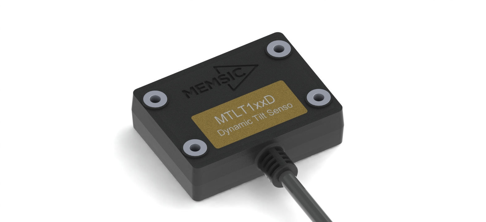

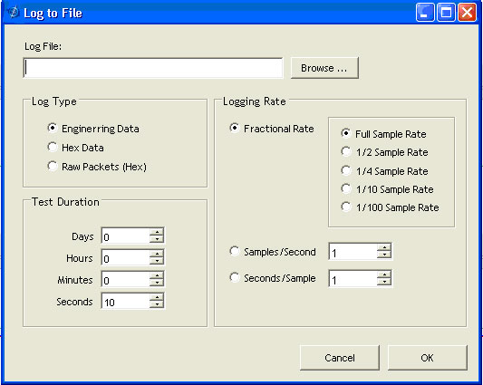

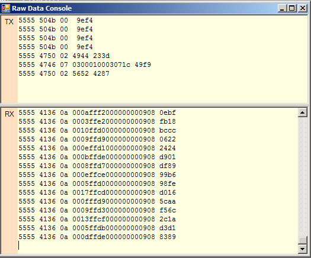
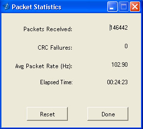
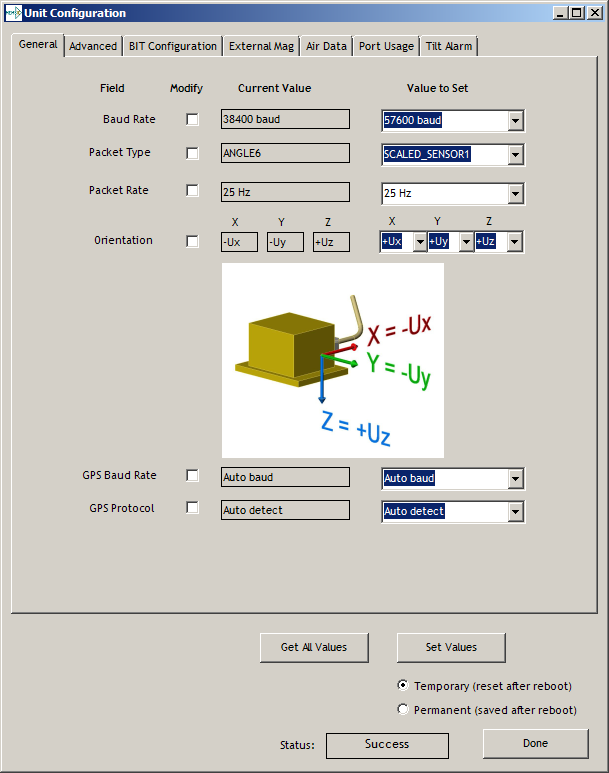
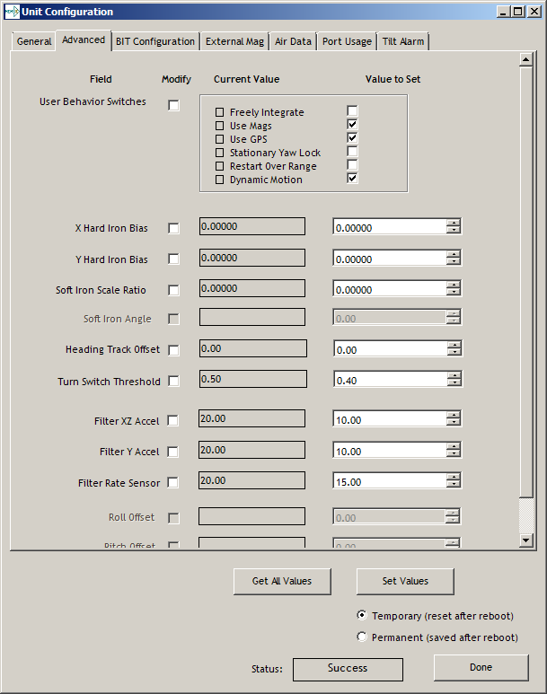
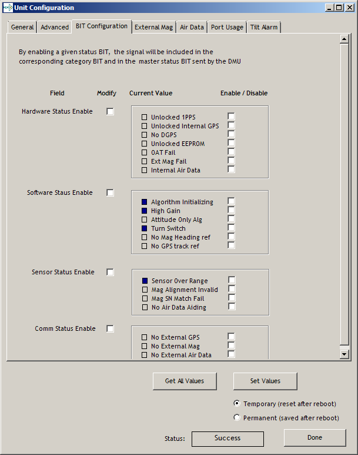
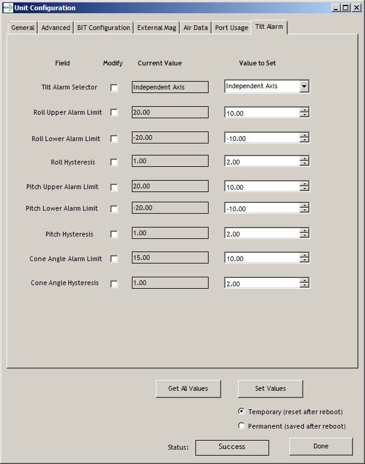

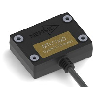
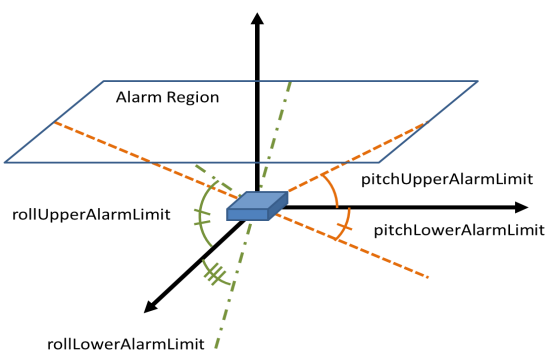
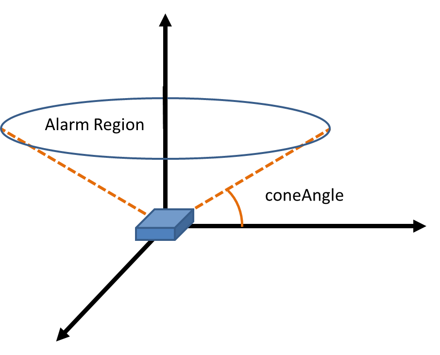
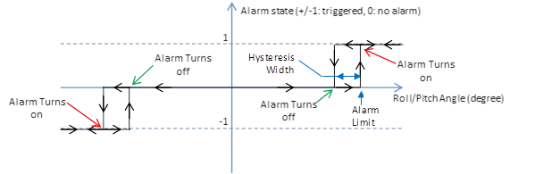

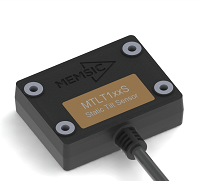
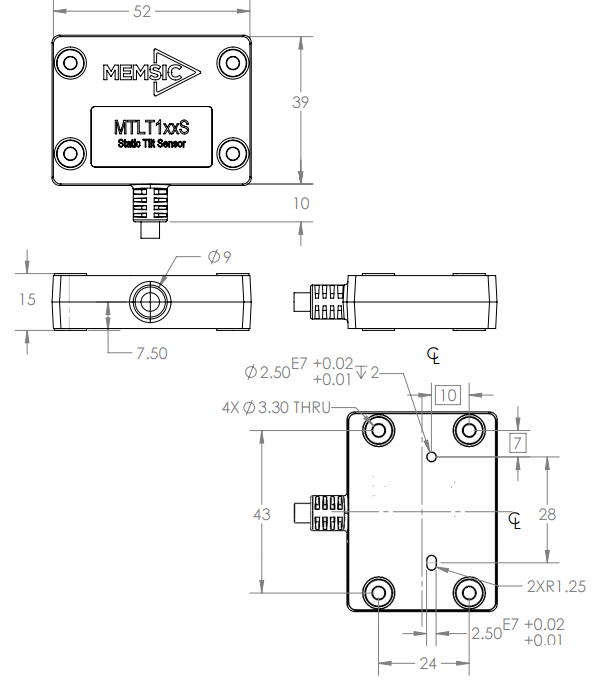
.. |appendix chart1| image:: media/image30.wmf
   :width: 5.49583in
   :height: 6.66944in
.. |appendix chart2| image:: media/image31.wmf
   :width: 5.49583in
   :height: 4.77361in

