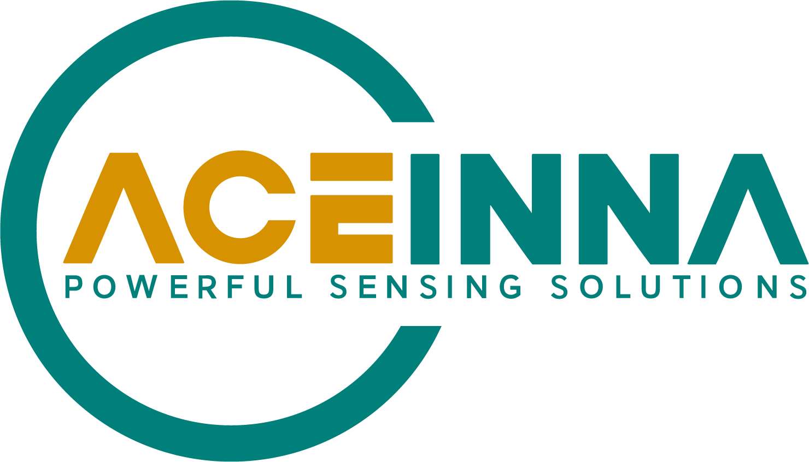

|image0|

**ANS is an open source ecosystem of inertial measurement unit**

A web-based development platform efficiently to build up navigation system

**Contents**

.. toctree::
    :maxdepth: 2

    can_protocol.rst

.. toctree::
    :maxdepth: 2
    
    MTLT_user_guide.rst

